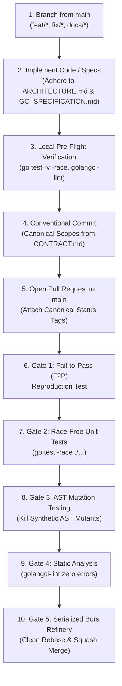

# Contributing to cli-leader

Thank you for your interest in contributing to **`cli-leader`**!

`cli-leader` is a high-assurance, pure-Go cognitive orchestrator designed for hierarchical AI supervision, speculative branch racing, and resilient multi-agent execution. To maintain system reliability, all contributions must adhere to strict architectural invariants, pure-Go zero-CGO standards, and automated verification gates.

All contributors and documentation authors must strictly adhere to the guidelines set forth in [docs/_review/CONTRACT.md](docs/_review/CONTRACT.md).

---



---

## 1. Feature Status Tags [v0.1 Core]

Every feature, capability, or architectural enhancement proposed in pull requests, documentation, or RFCs must have **exactly one** canonical status tag attached to its heading or specification block, in accordance with `CONTRACT.md §2`:

1. **`[v0.1 Core]`**: Fully implemented or part of the immediate minimal viable orchestrator release.
2. **`[Planned]`**: Actively architected and scheduled for upcoming milestone phases.
3. **`[Research]`**: Speculative exploration, theoretical design, or survey of emerging techniques.

> [!IMPORTANT]
> **Arbitrary Status Tags Prohibited**: Do NOT use non-canonical tags such as `[In Progress]`, `[Beta]`, `[Experimental]`, or `[v0.2]`. Map all proposed capabilities to one of the three canonical tags above.

---

## 2. Development Environment Setup [v0.1 Core]

### 2.1 Prerequisites [v0.1 Core]

Before contributing code, ensure your host environment meets the following requirements:

- **Go 1.22+**: The core toolchain must be Go 1.22 or higher. The codebase enforces **Zero-CGO**; static binary compilation must succeed on Linux (AMD64/ARM64) and macOS without requiring native C toolchains (`CGO_ENABLED=0`).
- **Git 2.30+**: Requires native `git worktree` support, which powers isolated worker execution, speculative branch racing, and Refinery merge queues.
- **Sandboxing Environment**:
  - **Tier 1 (Preferred)**: Bubblewrap (`bwrap`) installed for unprivileged Linux namespace isolation (`--ro-bind`, `--tmpfs`, `--unshare-pid`, `--unshare-net`).
  - **Tier 2 (Zero-Dependency Fallback)**: Linux kernel with Landlock LSM enabled for filesystem containment via self-re-exec trampoline.
- **golangci-lint**: Required for pre-flight static analysis.
  > `TODO(verify): Exact golangci-lint version and .golangci.yml linter configuration`

### 2.2 Building from Source [v0.1 Core]

Clone the repository and build the binary:

```bash
git clone https://github.com/01RG0/cli-leader.git
cd cli-leader
go build -o cli-leader ./cmd/cli-leader
```

### 2.3 Local Verification Commands [v0.1 Core]

Before submitting code, run the local verification suite:

```bash
# Run unit and race detector test suites
go test -v -race ./...

# Run static analysis and linting
golangci-lint run ./...

# Verify formatting and vetting
go fmt ./...
go vet ./...
```

---

## 3. Contribution & Git Branch Workflow [v0.1 Core]

### 3.1 Git Branch Naming Conventions [v0.1 Core]

All contributions must originate from a topic branch cut from the latest `main` branch. Topic branches must use standard hierarchical prefixes:

| Branch Pattern | Purpose | Example |
| :--- | :--- | :--- |
| `feat/<name>` | New capability or user-facing feature | `feat/gateway-fast-http` |
| `fix/<name>` | Bug fix or regression resolution | `fix/pty-pdeathsig` |
| `docs/<name>` | Documentation updates or overhauls | `docs/contributing-overhaul` |
| `refactor/<name>` | Internal restructuring without behavior change | `refactor/refinery-queue` |
| `test/<name>` | Adding or updating test suites and F2P tests | `test/f2p-dual-ledger` |
| `chore/<name>` | Tooling, dependencies, or maintenance | `chore/bump-deps` |

### 3.2 Step-by-Step Contribution Lifecycle [v0.1 Core]

1. **Synchronize Base**: Ensure your local `main` branch is up to date:
   ```bash
   git checkout main
   git pull origin main
   ```
2. **Create Branch**: Branch off `main` using the appropriate naming prefix:
   ```bash
   git checkout -b feat/my-new-feature
   ```
3. **Implement Changes**: Develop your changes adhering to package conventions in [docs/GO_SPECIFICATION.md](docs/GO_SPECIFICATION.md) and architectural invariants in [docs/ARCHITECTURE.md](docs/ARCHITECTURE.md).
4. **Verify Locally**: Execute `go test -v -race ./...` and `golangci-lint run ./...`.
5. **Format Commits**: Commit changes using the Conventional Commits format with canonical package scopes (see [Section 5](#5-commit-conventions--canonical-scopes-v01-core)).
6. **Submit PR**: Open a Pull Request targeting `main`. Include an overview of changes, test receipts, and assign appropriate status tags to any new feature headings.

---

## 4. PR Verification Gates & Refinery Merge Queue [v0.1 Core]

`cli-leader` does not accept natural language assertions of correctness. All pull requests must pass objective machine verification gates before being merged via the serialized Bors-style Refinery queue.

### 4.1 Gate 1: Fail-to-Pass (F2P) Automated TDD Protocol [v0.1 Core]

For any bug fix or functional behavioral change, contributors must follow the Fail-to-Pass (F2P) protocol:

1. **Reproduction Test**: Author a unit or integration test reproducing the issue. The test **MUST FAIL** (`exit_code != 0`) against unmodified `HEAD`, demonstrating the defect or absence of the feature.
2. **Patch Application**: Apply the proposed patch in the worktree.
3. **Pass Verification**: The reproduction test **MUST PASS** (`exit_code == 0`), and the full regression test suite must pass without regressions.
> `TODO(verify): Standard command-line invocation for local Fail-to-Pass (F2P) verification`

### 4.2 Gate 2: Race-Free Unit & Integration Suite [v0.1 Core]

All Go test suites across all packages must pass cleanly with the Go race detector enabled:

```bash
go test -v -race ./...
```

Any detected data race, deadlocks, goroutine leaks, or non-zero exit codes constitute an immediate hard failure.

### 4.3 Gate 3: AST Mutation Testing Verification Gate [v0.1 Core]

To eliminate hollow or tautological assertions, pull requests must pass the AST mutation testing verification gate (`cargo-mutants` style):

- The mutation runner injects synthetic AST defects into newly modified code (inverting booleans, replacing default return values, removing core statements).
- **Killed Mutants**: The test suite fails when executed against mutated ASTs. This confirms tests actively exercise the logic.
- **Survived Mutants**: The test suite passes despite mutated ASTs. Survived mutants indicate weak or tautological assertions; any survived mutant blocks merging and requires strengthening test cases.
> `TODO(verify): Mutation testing CLI command and exact kill threshold percentage for Go code`

### 4.4 Gate 4: Static Analysis & Linting Gate [v0.1 Core]

All proposed code must satisfy strict static analysis requirements:

```bash
golangci-lint run ./...
```

Code must compile cleanly with zero linter warnings, zero shadowed variables, and complete error-checking compliance.

### 4.5 Gate 5: Serialized Bors-Style Refinery Merge Queue [v0.1 Core]

Approved candidate branches are dispatched to the **Refinery** (`internal/refinery`):

- The Refinery checks out a clean staging branch from latest `main`.
- It rebases the candidate branch, executes all test suites and mutation verification gates in a clean sandbox worktree, and squashes the commits.
- If any test fails, the branch is rejected, and compensating Saga rollbacks clean up any non-git host side effects.
- Merges occur only upon generating verifiable machine proof receipts (exit code 0, matching diff hash, F2P proof receipts, static analysis zero-errors).
> `TODO(verify): Human reviewer approval requirements alongside Refinery Byzantine quorum consensus`

---

## 5. Commit Conventions & Canonical Scopes [v0.1 Core]

`cli-leader` enforces the [Conventional Commits](https://www.conventionalcommits.org/) standard. Commit messages must take the following form:

```
<type>(<scope>): <short description>

[optional body]

[optional footer(s)]
```

### 5.1 Permitted Commit Types [v0.1 Core]

- `feat`: New user-facing feature or orchestrator capability
- `fix`: Bug fix or patch
- `docs`: Documentation updates or additions
- `refactor`: Code reorganization with zero functional or behavioural changes
- `test`: Adding or modifying test suites, F2P reproduction tests, or benchmarks
- `perf`: Performance optimizations
- `chore`: Tooling, build scripts, or dependency adjustments

Breaking changes must include an exclamation mark after the scope (e.g., `feat(gateway)!: drop legacy protocol support`) and include a `BREAKING CHANGE:` footer.

### 5.2 Canonical Package Scopes [v0.1 Core]

Commit scopes must strictly map to the canonical Go package names and subsystems defined in `CONTRACT.md §3.2`:

| Scope | Canonical Package Path / Subsystem | Responsibility |
| :--- | :--- | :--- |
| `cmd` | `cmd/cli-leader` | CLI entrypoint, flag parsing, daemon bootstrap |
| `config` | `internal/config` | YAML and environment variable configuration loader |
| `gateway` | `internal/gateway` | FastHTTP Anthropic-compatible reverse proxy & stream transformer |
| `supervisor`| `internal/supervisor` | Erlang OTP supervision trees, process lifecycles, restart rate limits |
| `worker` | `internal/worker` | Worker manager, PTY subprocesses, circular log buffer, Git worktrees |
| `speculative`| `internal/speculative` | Speculative multi-worktree branch racing dispatcher |
| `refinery` | `internal/refinery` | Bors-style serialized merge queue and Saga rollback coordinator |
| `verification`| `internal/verification`| Fail-to-Pass engine, AST mutation testing, Byzantine quorum consensus |
| `state` | `internal/state` | Dual Ledger (`TaskLedger`, `ProgressLedger`), SQLite WAL durable replay, stall detection |
| `memory` | `internal/memory` | SQLite episodic store, vector search, Tree-Sitter RepoMap, Thompson Sampling |
| `mcp` | `internal/mcp` | Model Context Protocol server exposing orchestrator tools |
| `acp` | `internal/acp` | Agent Client Protocol server for IDE integration (Zed, JetBrains) |
| `sandbox` | `internal/sandbox` | Bubblewrap (`bwrap`) and Linux Landlock LSM isolation |
| `tui` | `internal/tui` | Charm Bubbletea terminal user interface, 30Hz ticker batcher, views |
| `notify` | `internal/notify` | Webhook notification dispatchers (Slack, Discord, Telegram) |

### 5.3 Commit Message Examples [v0.1 Core]

```
feat(gateway): add zero-allocation SSE streaming engine for OpenAI adapter
fix(worker): attach Pdeathsig SIGTERM to subprocess process group
docs(contributing): overhaul CONTRIBUTING.md per CONTRACT.md
test(verification): add fail-to-pass test suite for dual-ledger rollback
refactor(refinery): decouple saga compensation stack from git worktree cleanup
```

---

## 6. Architectural Invariants & Specification Reference [v0.1 Core]

To maintain modular documentation boundaries, architectural specifications and concrete Go interfaces are maintained in their respective canonical owner files. Contributors must consult these documents:

- **System Design & Architecture**: Refer to [docs/ARCHITECTURE.md](docs/ARCHITECTURE.md) for Erlang OTP supervision topologies (`one_for_one`, `one_for_all`), Dual-Ledger state machines, Temporal-grade SQLite WAL durable event replay, Saga non-git rollback stacks, and Bubblewrap/Landlock tiered sandboxing.
- **Technical Specification & Package Layout**: Refer to [docs/GO_SPECIFICATION.md](docs/GO_SPECIFICATION.md) for standard Go package structures, struct and interface definitions, Zero-CGO pure-Go dependencies, process safety (`Setsid: true`, `Pdeathsig = syscall.SIGTERM`), circular ring buffers, and TUI 30Hz ticker batching.
- **Project Roadmap & Milestones**: Refer to [docs/ROADMAP.md](docs/ROADMAP.md) for phase delivery schedules (Phase 1 through Phase 7) and feature readiness tracking.

---

## 7. Performance Claims & Documentation Standards [v0.1 Core]

When contributing to documentation or code comments, adhere to the following documentation standards per `docs/_review/CONTRACT.md`:

- **Target (unmeasured)**: Any claim of performance, throughput, or speed (such as "sub-10ms latency", "zero-overhead", or "60 FPS") that lacks an empirical benchmark citation must be written as `Target (unmeasured): <claim>` or revised to an architectural description.
- **Integrity & Verification**: Ensure all Mermaid diagrams compile cleanly without syntax errors, relative markdown links resolve to existing files, and tables use consistent GitHub-flavored markdown formatting.
- **Never Delete an Idea**: When reorganizing documentation, never delete substantive concepts. If an idea belongs to another document owner, migrate it to the appropriate file or log it in `docs/_review/<FILE>.ideas.md`.
