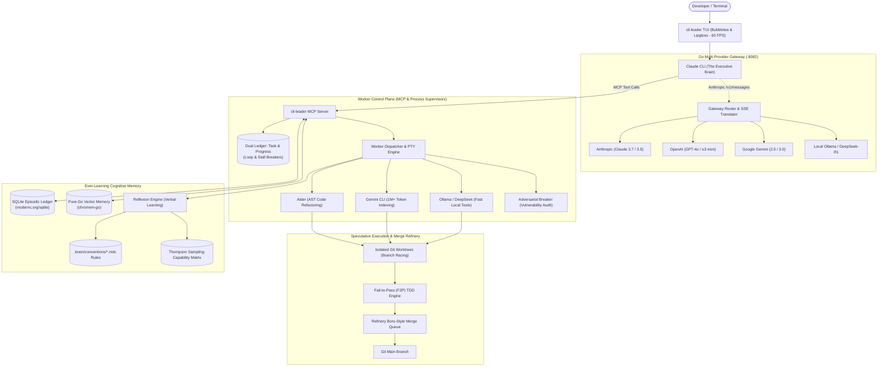

# cli-leader 🧠⚡

> **A high-performance autonomous meta-orchestrator built in Go.**  
> Uses **Claude CLI** as the central cognitive brain to direct, supervise, and learn from a swarm of specialized worker AI CLIs across multiple LLM providers.

---

## 🌟 Vision

Modern AI coding CLI tools (Claude Code, Aider, Gemini CLI, Ollama, DeepSeek, etc.) each have distinct superpowers: some excel at ultra-long context reasoning, some at fast local AST edits, others at low-cost bulk operations.

**`cli-leader`** unites them under a single unified intelligence:
1. **The Brain (Claude CLI)**: Acts as the executive leader, breaking down tasks, assigning work to specialized worker CLIs, and arbitrating technical decisions.
2. **Universal Multi-Provider Gateway**: Native Go reverse proxy translating Anthropic Messages API into OpenAI, Google Gemini, DeepSeek, Ollama, and OpenRouter protocols—allowing the Brain to run on any model with full SSE streaming and tool calling.
3. **Ever-Learning Cognitive Memory**: Central shared memory store (Reflexion verbal learning, scoped `.cursor/rules/*.mdc` conventions, and a Bayesian Thompson Sampling capability matrix) that makes every worker CLI smarter over time.
4. **Speculative Execution & Refinery Queue**: Dispatches parallel candidate workers in isolated Git worktrees ("Branch Racing") and verifies merges through a Bors-style Refinery queue.
5. **Adversarial Verification & F2P Testing**: Enforces Fail-to-Pass (F2P) test verification and pairs builders with adversarial breaker CLIs for rigorous audit before merging.
6. **Single Static Go Binary**: Blazing-fast (<10ms startup), rock-solid concurrency via goroutines, zero-CGO dependencies, and a smooth 60 FPS terminal UI powered by Charm's `bubbletea`.

---

## 🏗️ High-Level Architecture

---

## 📦 Core Pillars

| Pillar | Description |
|---|---|
| 🧠 **Claude Brain & MCP** | Exposes structured MCP tools for Claude CLI to dispatch, monitor, and abort workers, inspect diffs, and manage memory. |
| 🔄 **Multi-Provider Proxy** | Low-latency Anthropic API emulator in Go with SSE chunk framing, reasoning block translation, and `/v1/messages/count_tokens`. |
| 🏎️ **Speculative Branch Racing** | Launches parallel candidate workers in separate Git worktrees and automatically merges the best patch. |
| 🧪 **Fail-to-Pass (F2P) Testing** | Validates that reproduction tests fail on unmodified code before proving the fix passes and prevents regressions. |
| 🚦 **Refinery Merge Queue** | Serializes worktree merges, tests against current HEAD, and squashes cleanly with zero merge collisions. |
| 📚 **Ever-Learning Cognitive Bank** | Extracts verbal reflections from failures into `.cursor/rules/*.mdc` files, indexed via pure-Go vector search (`chromem-go`). |
| 📊 **Thompson Sampling Routing** | Bayesian multi-armed bandit profiling that dynamically routes tasks to the best worker based on cost, speed, and accuracy. |
| ⚡ **Go Native Systems Engine** | `creack/pty` with `Pdeathsig`, 30Hz TUI batching for smooth rendering, and tiered sandboxing (Bubblewrap + Landlock). |

---

## 📖 Documentation

- [System Architecture Deep Dive](docs/ARCHITECTURE.md)
- [Go Technical Specification & Package Layout](docs/GO_SPECIFICATION.md)
- [Development Roadmap & Milestones](docs/ROADMAP.md)

---

## 🚀 Technology Stack

- **Core Language**: Go 1.22+
- **Terminal UI**: [Charm CLI](https://charm.sh/) (`bubbletea`, `lipgloss`, `bubbles`)
- **Protocol**: Model Context Protocol (MCP) Go Server
- **Subprocess & PTY**: `os/exec`, `creack/pty` with Linux `Pdeathsig` process group management
- **Database & Vectors**: Pure Go embedded SQLite (`modernc.org/sqlite`) & in-memory vector store (`github.com/philippgille/chromem-go`)
- **Token Counting**: Pure Go BPE tokenization (`github.com/pkoukk/tiktoken-go`)
- **JSON Optimization**: High-performance mutation without reflection (`github.com/tidwall/gjson`, `github.com/tidwall/sjson`)
- **Sandboxing**: Bubblewrap (`bwrap`) & Linux Landlock LSM (`github.com/landlock-lsm/go-landlock`)
- **VCS Automation**: Native Git Worktree wrapping with mutex lock serialization

---

## 📄 License
MIT License.
