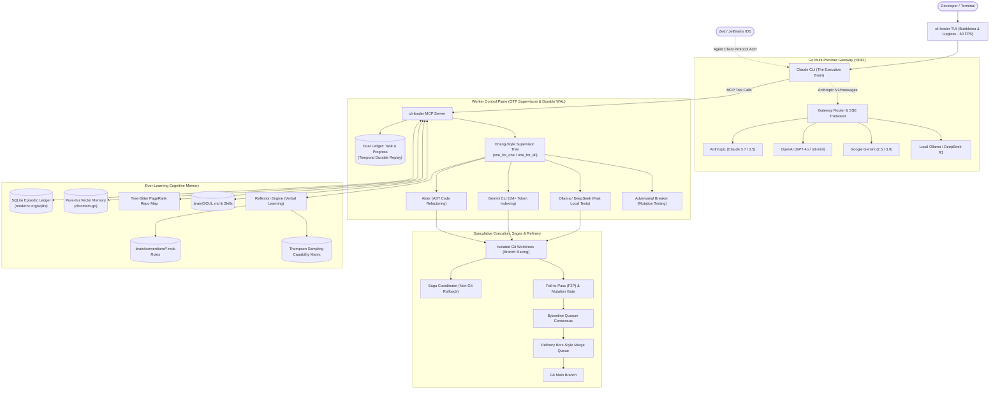

# cli-leader 🧠⚡

> **A high-performance autonomous meta-orchestrator built in Go.**  
> Uses **Claude CLI** as the central cognitive brain to direct, supervise, and learn from a swarm of specialized worker AI CLIs across multiple LLM providers.

---

## 🌟 Vision

Modern AI coding CLI tools (Claude Code, Aider, Gemini CLI, Ollama, DeepSeek, etc.) each have distinct superpowers: some excel at ultra-long context reasoning, some at fast local AST edits, others at low-cost bulk operations.

**`cli-leader`** unites them under a single unified intelligence:
1. **The Brain (Claude CLI)**: Acts as the executive leader, breaking down tasks, assigning work to specialized worker CLIs, and arbitrating technical decisions.
2. **Universal Multi-Provider Gateway**: Native Go reverse proxy translating Anthropic Messages API into OpenAI, Google Gemini, DeepSeek, Ollama, and OpenRouter protocols with sub-millisecond TTFT, SSE streaming state machines, and reasoning block translation.
3. **Ever-Learning Cognitive Memory**: Central shared memory store (Reflexion verbal learning, scoped `.cursor/rules/*.mdc` conventions, Hermes-style self-evolving skills, and Bayesian Thompson Sampling) that makes every worker CLI smarter over time.
4. **Speculative Execution & Refinery Queue**: Dispatches parallel candidate workers in isolated Git worktrees ("Branch Racing") and verifies merges through a Bors-style Refinery queue.
5. **Mutation Testing & F2P Verification**: Enforces Fail-to-Pass (F2P) test verification and mutation testing (`cargo-mutants` style) to eliminate hollow/tautological tests.
6. **Erlang OTP & Temporal Durability**: OTP supervision trees (`one_for_one`, `one_for_all`) for crash-proof process bundles, SQLite WAL durable event sourcing for instant zero-token resume, and Sagas for rolling back non-git side effects.
7. **Standards-Compliant (MCP & ACP)**: Natively speaks both Model Context Protocol (MCP) and Agent Client Protocol (ACP) to plug directly into Zed, JetBrains, and terminal multiplexers.
8. **Single Static Go Binary**: Blazing-fast (<10ms startup), rock-solid concurrency via goroutines, zero-CGO dependencies, and a smooth 60 FPS terminal UI powered by Charm's `bubbletea`.

---

## 🏗️ High-Level Architecture

---

## 📦 Core Pillars

| Pillar | Description |
|---|---|
| 🧠 **Claude Brain, MCP & ACP** | Exposes structured MCP tools for Claude CLI and implements the Agent Client Protocol (ACP) for Zed/JetBrains integration. |
| 🔄 **Multi-Provider Proxy** | Low-latency Anthropic API emulator in Go with zero-allocation SSE streaming, reasoning block translation, and `/v1/messages/count_tokens`. |
| 🏎️ **Speculative Branch Racing** | Launches parallel candidate workers in separate Git worktrees and automatically merges the best patch. |
| 🧪 **Mutation & F2P Testing** | Validates that reproduction tests fail before fix and injects synthetic AST mutations to kill hollow/tautological assertions. |
| 🛡️ **Erlang OTP & Sagas** | `one_for_one` worker isolation, `one_for_all` process bundles, and LIFO compensating Sagas for non-git side effects (`npm`, Docker, migrations). |
| 💾 **Temporal Durable Execution** | SQLite WAL append-only event log (`workflow_events`) enabling instant session resumption with zero duplicate token costs. |
| 🚦 **Refinery Merge Queue** | Serializes worktree merges, tests against current HEAD, and squashes cleanly with zero merge collisions. |
| 📚 **Ever-Learning Cognitive Bank** | Extracts verbal reflections from failures into `.cursor/rules/*.mdc` files, indexed via pure-Go vector search (`chromem-go`). |
| 🗺️ **Tree-Sitter Repo Map** | Aider-style Personalized PageRank over AST symbol graphs, delivering an ultra-compact codebase map (<1024 tokens). |
| 📊 **Two-Stage Routing Engine** | Sub-5ms semantic centroid pre-routing combined with Bayesian Thompson Sampling capability profiling. |
| ⚡ **Go Native Systems Engine** | `creack/pty` with `Pdeathsig`, 30Hz TUI batching for smooth rendering, and tiered sandboxing (Bubblewrap + Landlock). |

---

## 📖 Documentation

- [System Architecture Deep Dive](docs/ARCHITECTURE.md)
- [Cross-Language Ecosystem Innovations & Research](docs/ECOSYSTEM_INNOVATIONS.md)
- [Go Technical Specification & Package Layout](docs/GO_SPECIFICATION.md)
- [Development Roadmap & Milestones](docs/ROADMAP.md)

---

## 🚀 Technology Stack

- **Core Language**: Go 1.22+
- **Terminal UI**: [Charm CLI](https://charm.sh/) (`bubbletea`, `lipgloss`, `bubbles`)
- **Protocols**: Model Context Protocol (MCP) & Agent Client Protocol (ACP)
- **Subprocess & PTY**: `os/exec`, `creack/pty` with Linux `Pdeathsig` process group management
- **Database & Vectors**: Pure Go embedded SQLite (`modernc.org/sqlite`) & in-memory vector store (`github.com/philippgille/chromem-go`)
- **AST Parsing**: Tree-Sitter Go bindings (`github.com/smacker/go-tree-sitter`)
- **Token Counting**: Pure Go BPE tokenization (`github.com/pkoukk/tiktoken-go`)
- **JSON Optimization**: High-performance mutation without reflection (`github.com/tidwall/gjson`, `github.com/tidwall/sjson`)
- **Sandboxing**: Bubblewrap (`bwrap`) & Linux Landlock LSM (`github.com/landlock-lsm/go-landlock`)
- **VCS Automation**: Native Git Worktree wrapping with mutex lock serialization

---

## 📄 License
MIT License.
