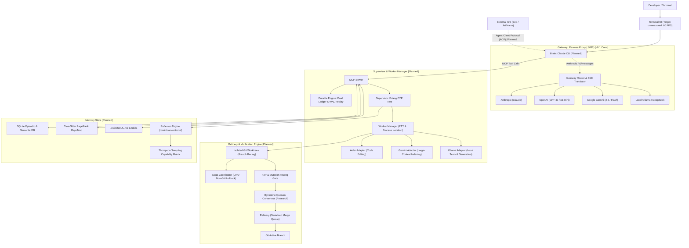

# cli-leader

> An autonomous meta-orchestrator built in Go.  
> Directs, supervises, and verifies specialized worker AI CLIs across multiple LLM providers using Claude CLI as an executive cognitive supervisor.

---

## 1. Overview & Core Value Proposition

Modern AI coding CLI tools (such as Claude Code, Aider, Gemini CLI, and Ollama) possess specialized operational profiles: repository-wide indexing over large context windows, localized Abstract Syntax Tree (AST) refactoring, or rapid local test execution. Operating these tools independently often introduces coordination friction, lack of process supervision, and risks of untrusted modifications directly on the active git branch.

`cli-leader` provides a unified execution and supervision substrate:

1. **Protocol Gateway**: An Anthropic-compatible reverse proxy translating `/v1/messages` requests to upstream providers (OpenAI, Google Gemini, Ollama, DeepSeek) with Server-Sent Events (SSE) streaming state machines and local token counting.
2. **Supervised Execution Plane**: Erlang OTP-style process supervision trees (`one_for_one`, `one_for_all`) and pseudo-terminal (PTY) session management with POSIX process group containment.
3. **Speculative Worktree Isolation**: Branch racing across isolated Git worktrees with automated Fail-to-Pass (F2P) verification, AST mutation gates, and serialized Bors-style Refinery merges.
4. **Durable Event Replay**: SQLite Write-Ahead Logging (WAL) event log ensuring long-running task resumption across process restarts.
5. **Shared Cognitive Memory**: Scoped conventions (`.brain/conventions/`), AST symbol dependency graphs (Tree-Sitter RepoMap), and Bayesian Thompson Sampling for capability-based worker dispatch.

---

## 2. Architecture Overview



---

## 3. Core Capabilities & Architectural Mapping

Every capability supported or scheduled in `cli-leader` maps directly to its architectural specification and Go package definition.

| Capability | Status | Description | Architectural Mapping |
| :--- | :--- | :--- | :--- |
| **Multi-Provider Reverse Proxy Gateway** | `[v0.1 Core]` | Native Go HTTP reverse proxy translating the Anthropic Messages protocol (`/v1/messages`) to OpenAI, Google Gemini, and Ollama/DeepSeek formats. Features local token counting (`/v1/messages/count_tokens`) and reasoning block translation. Target (unmeasured): sub-millisecond TTFT. | [`docs/ARCHITECTURE.md` § Subsystem 2](docs/ARCHITECTURE.md#subsystem-2-go-multi-provider-gateway-anthropic-protocol-emulator)<br>[`docs/GO_SPECIFICATION.md` § 1](docs/GO_SPECIFICATION.md#1-standard-project-layout) (`internal/gateway`) |
| **Executive Brain & MCP/ACP Protocol** | `[Planned]` | Orchestrates Claude CLI via Model Context Protocol (MCP) tool dispatch over stdio/SSE. Implements the Agent Client Protocol (ACP) JSON-RPC standard for direct integration with Zed and JetBrains IDEs. | [`docs/ARCHITECTURE.md` § Subsystem 1](docs/ARCHITECTURE.md#subsystem-1-the-executive-brain-mcp-agent-client-protocol-acp)<br>[`docs/GO_SPECIFICATION.md` § 1](docs/GO_SPECIFICATION.md#1-standard-project-layout) (`internal/mcp`, `internal/acp`) |
| **Durable Engine & Dual Ledger** | `[Planned]` | Dual-ledger state machine separating user invariants (`TaskLedger`) from atomic steps (`ProgressLedger`). Supported by SQLite WAL event logging (`workflow_events`) for crash-resilient replay and cryptographic stall loop detection. | [`docs/ARCHITECTURE.md` § Subsystem 1](docs/ARCHITECTURE.md#subsystem-1-the-executive-brain-mcp-agent-client-protocol-acp)<br>[`docs/GO_SPECIFICATION.md` § 2.2](docs/GO_SPECIFICATION.md#22-temporal-grade-durable-engine-sqlite-wal) (`internal/state`) |
| **Erlang OTP Process Supervision** | `[Planned]` | Hierarchical process supervision implementing `one_for_one` strategy for isolated workers and `one_for_all` for PTY/buffer bundles, with configurable restart intensity thresholds that escalate failures to the Brain. | [`docs/ARCHITECTURE.md` § Subsystem 3](docs/ARCHITECTURE.md#subsystem-3-worker-process-engine-erlang-otp-supervision-trees)<br>[`docs/GO_SPECIFICATION.md` § 2.1](docs/GO_SPECIFICATION.md#21-erlang-otp-supervisor-tree) (`internal/supervisor`) |
| **Worker Subprocess & Worktree Isolation** | `[Planned]` | Pseudo-terminal subprocess runner (`creack/pty`) with POSIX group containment (`Pdeathsig = syscall.SIGTERM`, `Setsid = true`), auto-reply regex interception, and mutex-serialized Git worktree workspaces. | [`docs/ARCHITECTURE.md` § Subsystem 3](docs/ARCHITECTURE.md#subsystem-3-worker-process-engine-erlang-otp-supervision-trees)<br>[`docs/GO_SPECIFICATION.md` § 1](docs/GO_SPECIFICATION.md#1-standard-project-layout) (`internal/worker`) |
| **Speculative Branch Racing** | `[Planned]` | Dispatches identical or decomposed tasks to multiple concurrent worker worktrees ("Branch Racing") and evaluates generated candidate patches concurrently. | [`docs/ARCHITECTURE.md` § Subsystem 4](docs/ARCHITECTURE.md#subsystem-4-speculative-branch-racing-saga-coordinator)<br>[`docs/GO_SPECIFICATION.md` § 1](docs/GO_SPECIFICATION.md#1-standard-project-layout) (`internal/speculative`) |
| **Compensating Saga Coordinator** | `[Planned]` | LIFO rollback execution stack to reverse non-git side effects (such as `npm install`, container state, or database migrations) when a speculative worktree candidate is abandoned. | [`docs/ARCHITECTURE.md` § Subsystem 4](docs/ARCHITECTURE.md#subsystem-4-speculative-branch-racing-saga-coordinator)<br>[`docs/GO_SPECIFICATION.md` § 2.3](docs/GO_SPECIFICATION.md#23-saga-non-git-side-effect-coordinator) (`internal/refinery`) |
| **Fail-to-Pass (F2P) Verification** | `[Planned]` | Enforces test-driven verification: requires a synthetic reproduction test to fail on unmodified code before confirming that candidate patches achieve a passing test suite. | [`docs/ARCHITECTURE.md` § Subsystem 5](docs/ARCHITECTURE.md#subsystem-5-fail-to-pass-f2p-mutation-testing-byzantine-quorum)<br>[`docs/GO_SPECIFICATION.md` § 1](docs/GO_SPECIFICATION.md#1-standard-project-layout) (`internal/verification`) |
| **Synthetic AST Mutation Testing** | `[Planned]` | Injects synthetic AST defects into candidate patches (`cargo-mutants` style) to verify that unit tests kill mutants and eliminate hollow or tautological assertions. | [`docs/ARCHITECTURE.md` § Subsystem 5](docs/ARCHITECTURE.md#subsystem-5-fail-to-pass-f2p-mutation-testing-byzantine-quorum)<br>[`docs/ECOSYSTEM_INNOVATIONS.md` § 2.2](docs/ECOSYSTEM_INNOVATIONS.md#22-mutation-testing-verification-gate-cargo-mutants) |
| **Byzantine Quorum Consensus** | `[Research]` | Multi-agent voting scheme aggregating peer evaluations weighted by Thompson-sampling confidence scores and verified machine proof receipts. | [`docs/ARCHITECTURE.md` § Subsystem 5](docs/ARCHITECTURE.md#subsystem-5-fail-to-pass-f2p-mutation-testing-byzantine-quorum)<br>[`docs/GO_SPECIFICATION.md` § 2.4](docs/GO_SPECIFICATION.md#24-byzantine-quorum-consensus-arbiter) (`internal/verification`) |
| **Bors-Style Refinery Merge Queue** | `[Planned]` | Serialized merge queue that rebases candidate branches against current HEAD, executes configured CI test commands, and performs clean squash-merges into the active branch. | [`docs/ARCHITECTURE.md` § Subsystem 4](docs/ARCHITECTURE.md#subsystem-4-speculative-branch-racing-saga-coordinator)<br>[`docs/GO_SPECIFICATION.md` § 1](docs/GO_SPECIFICATION.md#1-standard-project-layout) (`internal/refinery`) |
| **Tree-Sitter RepoMap** | `[Planned]` | Symbol definition and reference graph ranked by Personalized PageRank, rendering scoped structural codebase context within a strict token budget (target <1024 tokens). | [`docs/ARCHITECTURE.md` § Subsystem 6](docs/ARCHITECTURE.md#subsystem-6-ever-learning-cognitive-memory-bank)<br>[`docs/GO_SPECIFICATION.md` § 2.5](docs/GO_SPECIFICATION.md#25-tree-sitter-pagerank-repo-map-engine) (`internal/memory`) |
| **Reflexion Verbal Learning & Memory** | `[Planned]` | Verbal reinforcement loop that distills compiler errors and test failures into reusable directives stored in `.brain/conventions/*.mdc`, indexed alongside SQLite episodic history. | [`docs/ARCHITECTURE.md` § Subsystem 6](docs/ARCHITECTURE.md#subsystem-6-ever-learning-cognitive-memory-bank)<br>[`docs/GO_SPECIFICATION.md` § 1](docs/GO_SPECIFICATION.md#1-standard-project-layout) (`internal/memory`) |
| **Two-Stage Routing & Thompson Sampling** | `[Planned]` | Dynamic worker selection combining semantic centroid pre-routing with Bayesian multi-armed bandit capability profiling. Target (unmeasured): sub-5ms pre-routing. | [`docs/ARCHITECTURE.md` § Subsystem 6](docs/ARCHITECTURE.md#subsystem-6-ever-learning-cognitive-memory-bank)<br>[`docs/GO_SPECIFICATION.md` § 1](docs/GO_SPECIFICATION.md#1-standard-project-layout) (`internal/memory`) |
| **Tiered Subprocess Sandboxing** | `[Planned]` | Containerless filesystem and network isolation via Bubblewrap (`bwrap`) unprivileged namespaces, with automatic fallback to Linux Landlock LSM. | [`docs/ARCHITECTURE.md` § Subsystem 7](docs/ARCHITECTURE.md#subsystem-7-tiered-workspace-sandboxing)<br>[`docs/GO_SPECIFICATION.md` § 1](docs/GO_SPECIFICATION.md#1-standard-project-layout) (`internal/sandbox`) |
| **Terminal UI Mission Control** | `[Planned]` | Charm Bubbletea dashboard decoupling high-throughput PTY log streams using a 30Hz ticker batcher and circular ring buffer. Target (unmeasured): 60 FPS rendering. | [`docs/ARCHITECTURE.md` § Subsystem 3](docs/ARCHITECTURE.md#subsystem-3-worker-process-engine-erlang-otp-supervision-trees)<br>[`docs/GO_SPECIFICATION.md` § 1](docs/GO_SPECIFICATION.md#1-standard-project-layout) (`internal/tui`) |

---

## 4. Quickstart Guide

### 4.1 Prerequisites
- **Go**: 1.22 or newer
- **Git**: 2.30 or newer (with `git worktree` support enabled)
- **Host OS**: Linux (x86_64, arm64) or macOS
- **Optional**: Bubblewrap (`bwrap`) for enhanced sandbox isolation

### 4.2 Building from Source
`cli-leader` compiles into a single static binary without CGO dependencies:

```bash
git clone https://github.com/01RG0/cli-leader.git
cd cli-leader
go build -o cli-leader ./cmd/cli-leader
```

Target (unmeasured): <10ms process initialization.

### 4.3 Configuration Setup
Create your local runtime configuration from the provided template:

```bash
cp cli-leader.example.yaml cli-leader.yaml
```

Set required upstream API credentials in your environment:

```bash
# OpenAI upstream
export OPENAI_API_KEY="sk-..."

# Or Google Gemini upstream
export GEMINI_API_KEY="AIzaSy..."

# Or Anthropic direct passthrough
export ANTHROPIC_API_KEY="sk-ant-..."
```

### 4.4 Launching the Daemon
Start the `cli-leader` supervisor daemon:

```bash
./cli-leader start --config cli-leader.yaml
```

> [!NOTE]
> `TODO(verify): default_config_search_order` — Verification required for fallback configuration search paths when `--config` is omitted.

### 4.5 Connecting Claude CLI
In an adjacent terminal session, direct Claude CLI to route through the `cli-leader` multi-provider gateway:

```bash
export ANTHROPIC_BASE_URL="http://127.0.0.1:8082"
claude
```

> [!NOTE]
> `TODO(verify): claude_cli_executable_name` — Verification required for whether the executive Brain invokes `claude`, `claude-code`, or a configurable binary path.

---

## 5. Configuration Specification

The configuration file defines provider endpoints, worker supervisors, speculative candidate limits, and verification pipelines. The snippet below highlights canonical configuration keys matching [`cli-leader.example.yaml`](cli-leader.example.yaml):

```yaml
version: "1.0"

# 1. Multi-Provider Gateway Settings [v0.1 Core]
gateway:
  listen_addr: "127.0.0.1:8082"
  default_provider: "openai" # Options: anthropic, openai, gemini, ollama
  providers:
    openai:
      base_url: "https://api.openai.com/v1"
      api_key_env: "OPENAI_API_KEY"
      model_mapping:
        "claude-3-7-sonnet-20250219": "o3-mini"
        "claude-3-5-sonnet-20241022": "gpt-4o"
    gemini:
      base_url: "https://generativelanguage.googleapis.com/v1beta/openai"
      api_key_env: "GEMINI_API_KEY"
      model_mapping:
        "claude-3-7-sonnet-20250219": "gemini-2.5-pro"
    ollama:
      base_url: "http://localhost:11434/v1"
      model_mapping:
        "claude-3-7-sonnet-20250219": "deepseek-r1:70b"

# 2. Worker Swarm & OTP Supervision Policies [Planned]
workers:
  supervisor:
    max_restarts: 3           # Max restarts allowed before escalating to Brain
    period_seconds: 30        # Rate limit window in seconds
    heartbeat_timeout_sec: 15 # Terminate worker if no output within timeout
  aider:
    binary: "aider"
    flags: ["--no-auto-commits", "--yes-always"]
    categories: ["refactoring", "code_edit"]
  gemini:
    binary: "gemini"
    flags: ["--non-interactive"]
    categories: ["indexing", "search"]
  ollama:
    binary: "ollama"
    categories: ["test_generation", "boilerplate"]

# 3. Speculative Branch Racing & Merge Refinery [Planned]
speculative:
  enabled: true
  max_parallel_candidates: 2

refinery:
  test_command: "go test -v ./..."
  mutation_testing: true
  squash_merges: true

# 4. Cognitive Memory & Conventions [Planned]
memory:
  db_path: ".brain/memory.db"
  conventions_dir: ".brain/conventions"
  soul_file: ".brain/SOUL.md"
  max_repo_map_tokens: 1024
  max_injected_rule_tokens: 800
  thompson_sampling: true

# 5. Security Sandboxing [Planned]
sandbox:
  tier: "auto"                # Options: bwrap, landlock, none
  allow_network: false

# 6. Notifications [Planned]
notifications:
  slack_webhook: ""
  discord_webhook: ""
  telegram_chat_id: ""
```

> [!NOTE]
> `TODO(verify): env_var_overrides` — Verification required for environment variable precedence conventions matching configuration keys.

---

## 6. Technology Summary Table

| Component Layer | Technology / Library | Architectural Role | License |
| :--- | :--- | :--- | :--- |
| **Language Runtime** | Go 1.22+ | Statically compiled runtime, goroutine concurrency, zero-CGO target | BSD-3-Clause |
| **Reverse Proxy** | FastHTTP / Standard Library | Anthropic `/v1/messages` protocol translation and SSE streaming | MIT / BSD |
| **Terminal UI** | [Charm](https://charm.sh/) (`bubbletea`, `lipgloss`) | Multi-pane terminal interface with 30Hz batched rendering | MIT |
| **Durable Store** | `modernc.org/sqlite` | Pure-Go SQLite engine for Write-Ahead Logging (WAL) event replay | BSD-3-Clause |
| **Vector Engine** | `chromem-go` | Pure-Go in-memory vector index for rule and memory retrieval | MIT |
| **AST Symbol Parsing** | `smacker/go-tree-sitter` | Multi-language AST parsing for RepoMap and mutation defect injection | MIT |
| **Token Counting** | `pkoukk/tiktoken-go` | Local BPE token counting for `/v1/messages/count_tokens` pre-flight checks | MIT |
| **PTY Subprocess** | `creack/pty` | Pseudo-terminal allocation and POSIX process group lifecycle management | MIT |
| **Sandbox Containment** | `bwrap` & `go-landlock` | Linux namespace and Landlock LSM filesystem and network restriction | LGPL / Apache-2.0 |
| **VCS Isolation** | Native `git worktree` | Concurrent branch isolation with mutex-serialized lifecycle operations | GPL-2.0 |

Detailed dependency definitions, struct interfaces, and concurrency semantics are maintained in [`docs/GO_SPECIFICATION.md`](docs/GO_SPECIFICATION.md).

---

## 7. Deep Documentation Directory

Information in `cli-leader` is partitioned according to the Document Ownership Map in [`docs/_review/CONTRACT.md`](docs/_review/CONTRACT.md):

- **[System Architecture Deep Dive](docs/ARCHITECTURE.md)**: Design decisions, OTP supervisor trees, dual ledger state machines, sandbox models, and protocol definitions (MCP & ACP).
- **[Go Technical Specification & Package Layout](docs/GO_SPECIFICATION.md)**: Concrete Go package layouts, interfaces, structs, method signatures, concurrency semantics, and error handling contracts.
- **[Development Roadmap & Milestones](docs/ROADMAP.md)**: Implementation phases (Phase 1 through Phase 7), delivery timelines, and inter-component dependencies.
- **[Cross-Language Ecosystem Innovations & Research](docs/ECOSYSTEM_INNOVATIONS.md)**: Comparative analysis of external frameworks (Aider, Claude Code, OpenHands, Hermes Agent, Tutti, Gastown), theoretical inspirations, and algorithmic notes.
- **[Contributing Guide](CONTRIBUTING.md)**: Contribution workflows, branch naming, pull request guidelines, and development requirements.

---

## 8. License

This project is licensed under the MIT License.
