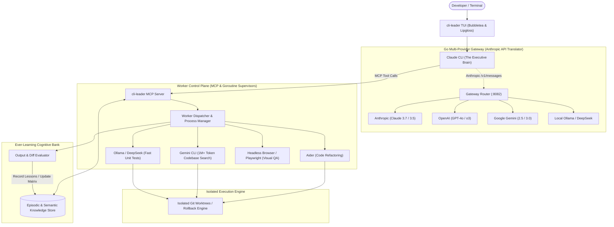

# cli-leader 🧠⚡

> **A high-performance autonomous meta-orchestrator built in Go.**  
> Uses **Claude CLI** as the central cognitive brain to direct, supervise, and learn from a swarm of specialized worker AI CLIs across multiple LLM providers.

---

## 🌟 Vision

Modern AI coding CLI tools (Claude Code, Aider, Gemini CLI, Ollama, DeepSeek, etc.) each have distinct superpowers: some excel at ultra-long context reasoning, some at fast local AST edits, others at low-cost bulk operations.

**`cli-leader`** unites them under a single unified intelligence:
1. **The Brain (Claude CLI)**: Acts as the executive leader, breaking down tasks, assigning work to specialized worker CLIs, and arbitrating technical decisions.
2. **Universal Multi-Provider Gateway**: Native Go reverse proxy translating Anthropic Messages API into OpenAI, Google Gemini, DeepSeek, Ollama, and OpenRouter protocols—allowing the Brain to run on any model.
3. **Ever-Learning Cognitive Memory**: Central shared memory store (episodic task history, project conventions, and a dynamic CLI capability matrix) that makes every worker CLI smarter over time.
4. **Adversarial Peer Review & Isolation**: Runs workers in isolated Git worktrees and pairs builders with adversarial breaker CLIs for rigorous verification before merging.
5. **Single Static Go Binary**: Blazing-fast (<10ms startup), rock-solid concurrency via goroutines, and a beautiful terminal UI powered by Charm's `bubbletea`.

---

## 🏗️ High-Level Architecture

---

## 📦 Core Pillars

| Pillar | Description |
|---|---|
| 🧠 **Claude Brain & MCP** | Exposes structured MCP tools for Claude CLI to launch, monitor, inspect, and abort worker CLIs. |
| 🔄 **Multi-Provider Proxy** | Transparent Anthropic API emulator in Go routing requests to any LLM backend (OpenAI, Gemini, Ollama, DeepSeek). |
| 📚 **Ever-Learning Engine** | Dynamically tracks project rules, bug patterns, and CLI performance scores. Automatically distributes knowledge across workers. |
| 🛡️ **Sandbox & Verification** | Git worktree isolation per task with automated rollback on test failures, plus adversarial Red/Blue code audits. |
| ⚡ **Go Native Performance** | Compiled static binary, sub-10ms latency, zero runtime dependencies, and a smooth Charm `bubbletea` dashboard. |

---

## 📖 Documentation

- [System Architecture Deep Dive](docs/ARCHITECTURE.md)
- [Go Technical Specification & Package Layout](docs/GO_SPECIFICATION.md)
- [Development Roadmap & Milestones](docs/ROADMAP.md)

---

## 🚀 Technology Stack

- **Core Language**: Go 1.22+
- **Terminal UI**: [Charm CLI](https://charm.sh/) (`bubbletea`, `lipgloss`, `bubbles`)
- **Protocol**: Model Context Protocol (MCP) Go Server
- **Subprocess / PTY**: `os/exec`, `creack/pty` for interactive CLI automation
- **Database / Memory**: Pure Go SQLite / Embeddings (`modernc.org/sqlite`)
- **VCS Automation**: `go-git` / Git Worktree management

---

## 📄 License
MIT License.
