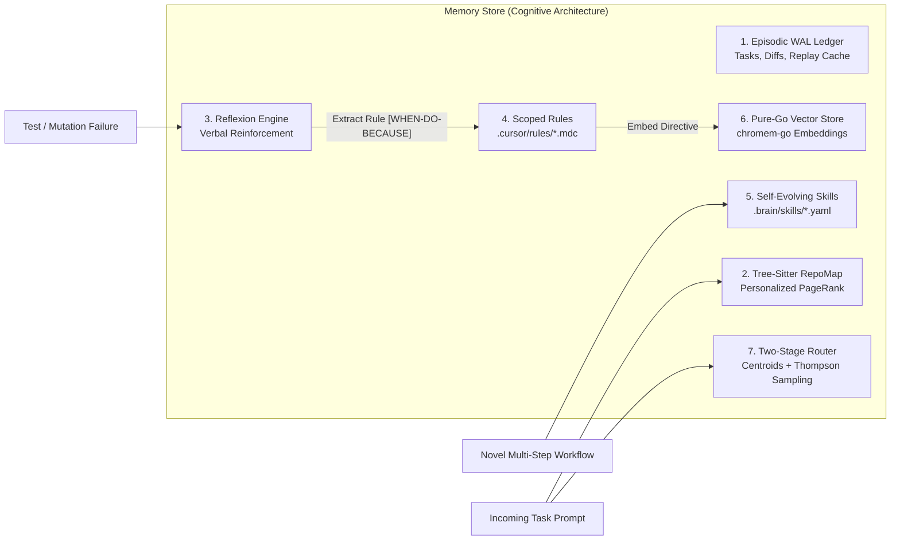

# System Architecture Deep Dive

## 1. Architectural Philosophy [v0.1 Core]

`cli-leader` is designed around the principle of **Hierarchical Cognitive Orchestration & Resilient Systems**:
- **Cognitive Specialization**: High-level architectural reasoning, strategic planning, and orchestration are centralized into the **Brain** (implemented via Claude CLI).
- **Execution Delegation**: Concrete code editing, terminal commands, unit test generation, and deep repository indexing are delegated to specialized **Worker CLIs** (such as Aider, Gemini CLI, or Ollama).
- **OTP Supervision & Durable Engine**: Worker processes are supervised through Erlang/Elixir-inspired **OTP Supervision Trees** with fate-sharing boundaries. All workflow events are persisted to an append-only SQLite WAL event log by the **Durable Engine**, enabling crash-proof workflow resumption without re-executing completed operations.
- **Git as the Execution Engine, Sagas Protect the Host**: All source code mutations execute in isolated Git worktrees. Non-git side effects (such as package installations, database migrations, or container lifecycles) are managed by a **Saga** coordinator maintaining a LIFO compensating rollback stack.
- **Objective Verification**: Natural language claims have zero weight. Code modifications must pass a **Fail-to-Pass (F2P)** protocol, an AST-level **Mutation Testing Gate** (`cargo-mutants` style), and **Byzantine Quorum Consensus** before entering the serialized Bors-style **Refinery** merge queue.

---

## 2. Component Architecture [v0.1 Core]

```
┌────────────────────────────────────────────────────────────────────────┐
│                        cli-leader Daemon (Go)                          │
│                                                                        │
│  ┌───────────────────────┐              ┌───────────────────────────┐  │
│  │        Gateway        │              │  Model Context Protocol   │  │
│  │ (Anthropic Emulator)  │              │  & Agent Client Protocol  │  │
│  └──────────▲────────────┘              └─────────────▲─────────────┘  │
│             │ HTTP                                    │ JSON-RPC       │
│  ┌──────────▼────────────┐              ┌─────────────▼─────────────┐  │
│  │   Brain (Claude CLI)  │◄────────────►│ Dual-Ledger State Machine │  │
│  └───────────────────────┘              │ (SQLite WAL Durable Replay│  │
│                                         └─────────────┬─────────────┘  │
│                                                       │ OTP Trees      │
│  ┌──────────────────────────────────────────────┐     │                │
│  │                 Memory Store                 │◄────┤                │
│  │ - SQLite Episodic Ledger (WAL)               │     ▼                │
│  │ - Tree-Sitter PageRank RepoMap               │ ┌──────────────────┐ │
│  │ - Scoped Rules (.cursor/rules/*.mdc)         │ │  OTP Supervisor  │ │
│  │ - Evolving Skills & Soul File (.brain/SOUL)  │ │ (one_for_one /   │ │
│  │ - Two-Stage Thompson Sampling Matrix         │ │  one_for_all)    │ │
│  └──────────────────────────────────────────────┘ └────────┬─────────┘ │
│                                                            │           │
│  ┌─────────────────────────────────────────────────────────▼────────┐  │
│  │ Worker Manager, Speculative Sagas & Refinery Merge Queue         │  │
│  │ - PTY Subprocesses & RingLogBuffer                               │  │
│  │ - Isolated Git Worktrees (Branch Racing)                         │  │
│  │ - Saga Coordinator (Non-Git Side-Effect LIFO Rollbacks)          │  │
│  │ - Fail-to-Pass (F2P) & Mutation Testing Verification Gate        │  │
│  │ - Byzantine Quorum Consensus (Machine Proof Receipts)            │  │
│  │ - Serialized Bors-Style Refinery Merge Queue                     │  │
│  └──────────────────────────────────────────────────────────────────┘  │
└────────────────────────────────────────────────────────────────────────┘
```

The system separates concerns across specialized subsystems coordinated through the `cli-leader` daemon. Concrete Go interfaces and data structures are defined in [GO_SPECIFICATION.md](GO_SPECIFICATION.md), and milestone deliverables are scheduled in [ROADMAP.md](ROADMAP.md).

---

## 3. The 7 Core Subsystems

### Subsystem 1: Brain Supervisor, MCP & Agent Client Protocol (ACP) [Planned]

The **Brain** (Claude CLI) operates as an agentic supervisor connecting to `cli-leader`'s built-in **Model Context Protocol (MCP)** server over stdio or local SSE. In parallel, `cli-leader` provides an **Agent Client Protocol (ACP)** JSON-RPC server—adhering to the protocol co-authored by Zed Industries and JetBrains—allowing the daemon to plug directly into external editor environments.

#### 3.1.1 Dual-Ledger Pattern [Planned]
To prevent infinite loops and context contamination, `cli-leader` enforces strict separation of execution state via a **Dual Ledger**:
1. **TaskLedger (`tasks`)**: Immutable record of high-level user objectives, architectural constraints, and invariant acceptance criteria.
2. **ProgressLedger (`task_steps`)**: Dynamic state machine tracking granular step statuses (`pending`, `running`, `reviewing`, `completed`, `failed`).

Concrete struct definitions for `TaskLedger` and `ProgressLedger` are specified in [GO_SPECIFICATION.md](GO_SPECIFICATION.md#1-standard-project-layout) under `internal/state/dual_ledger.go`.

#### 3.1.2 Durable Engine (Temporal-Grade SQLite WAL Replay) [Planned]
The **Durable Engine** implements a SQLite WAL-backed event replay mechanism inspired by Temporal and Cadence:
- Every state transition and tool invocation is recorded in an append-only SQLite WAL table (`workflow_events`).
- On daemon crash, host restart, or network interruption, the engine deterministically replays workflow events from the event log.
- Completed step outcomes are returned directly from the replay cache, preventing the re-execution of completed side effects and avoiding duplicate upstream LLM token consumption.

#### 3.1.3 Stall Detector (SHA256 State Hashing & Loop Breaker) [Planned]
The **Stall Detector** mitigates autonomous thrashing:
- Computes cryptographic digests: $\text{Digest} = \text{SHA256}(\text{tool} \parallel \text{args} \parallel \text{diff})$.
- Tracks sequential identical state hashes. If identical states repeat across 3 consecutive iterations or step counters exceed safety thresholds without forward progress, the Stall Detector terminates the loop and raises an emergency escalation to the Brain for replanning.

#### 3.1.4 Boomerang Subtask Packets [Planned]
Worker CLIs execute in isolated contexts rather than inheriting the Brain's full multi-turn conversation history. Workers return structured **Boomerang Result Packets** containing:
- Quantitative diff statistics (lines added, modified, deleted).
- Exit codes and execution status.
- Verification receipts and brief rationale summary (targeted under 250 tokens).

#### 3.1.5 Model Context Protocol (MCP) Tool Contracts [Planned]
The built-in MCP server in `internal/mcp` exposes tools to the Brain over stdio and local SSE:

##### `dispatch_worker`
Spawns an isolated worker CLI task in a dedicated Git worktree.
```json
{
  "name": "dispatch_worker",
  "description": "Dispatches an isolated worker CLI inside a dedicated Git worktree.",
  "parameters": {
    "type": "object",
    "properties": {
      "cli_name": {
        "type": "string",
        "enum": ["aider", "gemini", "ollama", "generic"],
        "description": "Target CLI tool adapter."
      },
      "task_prompt": {
        "type": "string",
        "description": "Specific, actionable instruction for the worker."
      },
      "target_files": {
        "type": "array",
        "items": { "type": "string" },
        "description": "Target file paths scoping worker edits."
      },
      "flags": {
        "type": "array",
        "items": { "type": "string" },
        "description": "Optional CLI adapter flags."
      }
    },
    "required": ["cli_name", "task_prompt"]
  }
}
```

##### `dispatch_speculative`
Spawns multiple candidate workers in parallel for Branch Racing.
```json
{
  "name": "dispatch_speculative",
  "description": "Runs parallel candidate workers in separate worktrees and selects the best verified patch.",
  "parameters": {
    "type": "object",
    "properties": {
      "candidates": {
        "type": "array",
        "items": {
          "type": "object",
          "properties": {
            "cli_name": { "type": "string" },
            "prompt": { "type": "string" }
          },
          "required": ["cli_name", "prompt"]
        }
      },
      "target_files": {
        "type": "array",
        "items": { "type": "string" }
      }
    },
    "required": ["candidates"]
  }
}
```

##### `verify_f2p`
Runs Fail-to-Pass (F2P) and mutation testing verification gates against a modified worktree.
```json
{
  "name": "verify_f2p",
  "description": "Executes reproduction test and mutation testing gate against a completed worktree.",
  "parameters": {
    "type": "object",
    "properties": {
      "task_id": { "type": "string" },
      "reproduction_test_cmd": { "type": "string" },
      "enable_mutation_gate": { "type": "boolean", "default": true }
    },
    "required": ["task_id", "reproduction_test_cmd"]
  }
}
```

##### `refinery_enqueue`
Enqueues a verified worktree into the Bors-style Refinery merge queue.
```json
{
  "name": "refinery_enqueue",
  "description": "Enqueues a verified worktree branch for serialized testing and squash-merging into main.",
  "parameters": {
    "type": "object",
    "properties": {
      "task_id": { "type": "string" },
      "commit_message": { "type": "string" }
    },
    "required": ["task_id", "commit_message"]
  }
}
```

##### `query_brain_memory`
Queries episodic history, `.mdc` scoped rules, and the Tree-Sitter RepoMap.
```json
{
  "name": "query_brain_memory",
  "description": "Searches cognitive memory, project rules, and codebase symbol graph.",
  "parameters": {
    "type": "object",
    "properties": {
      "query": { "type": "string" },
      "category": {
        "type": "string",
        "enum": ["all", "rules", "history", "symbols", "skills"]
      }
    },
    "required": ["query"]
  }
}
```

#### 3.1.6 Agent Client Protocol (ACP) Protocol Contracts [Planned]
The ACP server in `internal/acp` communicates via JSON-RPC 2.0 over stdio with external IDEs:

##### Initial Handshake (`initialize`)
```json
{
  "jsonrpc": "2.0",
  "id": 1,
  "method": "initialize",
  "params": {
    "protocolVersion": "1.0",
    "clientInfo": {
      "name": "zed",
      "version": "0.180.0"
    },
    "capabilities": {
      "streaming": true,
      "diffInspection": true
    }
  }
}
```

##### Thread Message Dispatch (`agent/sendMessage`)
```json
{
  "jsonrpc": "2.0",
  "id": 2,
  "method": "agent/sendMessage",
  "params": {
    "threadId": "th_987",
    "message": {
      "role": "user",
      "content": "Implement user password hashing using bcrypt."
    }
  }
}
```
*TODO(verify): ACP agent/sendMessage streaming response structure* (tracked in [ARCHITECTURE.questions.md](_review/ARCHITECTURE.questions.md#open-questions--verification-items)).

---

### Subsystem 2: Multi-Provider Gateway (Anthropic Protocol Translation) [v0.1 Core]

The **Gateway** is an internal Anthropic-compatible reverse proxy implemented in pure Go (`internal/gateway`), listening locally on `127.0.0.1:8082`. Because Claude CLI natively issues requests to the Anthropic `/v1/messages` endpoint, the Gateway translates outbound messages into the APIs of upstream providers (OpenAI, Gemini, Ollama) and streams responses back in Anthropic-compliant Server-Sent Events (SSE).

#### 3.2.1 FastHTTP Reverse Proxy & Architecture [v0.1 Core]
- Embedded reverse proxy architecture based on `fasthttp`.
- Intercepts requests, strips Anthropic-specific prompt-caching headers (`cache_control`), and dispatches to configured provider adapters in `internal/gateway/providers/`.

#### 3.2.2 Zero-Allocation SSE Streaming Engine [v0.1 Core]
- Performs framing and chunk translation from upstream OpenAI chunk deltas into Anthropic SSE events:
  $$\text{content\_block\_start} \longrightarrow \text{content\_block\_delta} \longrightarrow \text{content\_block\_stop} \longrightarrow \text{message\_stop}$$
- Directly manipulates byte slices using `tidwall/gjson` and `tidwall/sjson` without reflection allocations.
- Performance target: **Target (unmeasured): <100 µs TTFT overhead**.

#### 3.2.3 Reasoning Block Preservation [v0.1 Core]
- Bidirectionally maps upstream DeepSeek-R1 `reasoning_content` to Anthropic `thinking` blocks (`thinking_delta`).
- Preserves thinking blocks and associated cryptographic signatures across multi-turn conversations for durable replay.
- *TODO(verify): Gemini streaming thinking block envelope specification* (tracked in [ARCHITECTURE.questions.md](_review/ARCHITECTURE.questions.md#open-questions--verification-items)).

#### 3.2.4 Tool Calling & Multi-Turn Role Decomposition [v0.1 Core]
- Decomposes combined Anthropic user turns containing text and tool execution results into separate `tool` messages followed by a trailing `user` message for OpenAI-compatible upstreams.
- Converts JSON Schema declarations (`input_schema` to `parameters`).
- Sanitizes tool identifier names to conform with Gemini schema requirements (`^[a-zA-Z_][a-zA-Z0-9_]*$`).

#### 3.2.5 Local Token Counting [v0.1 Core]
- Handles `POST /v1/messages/count_tokens` locally via `tiktoken-go` (BPE tokenizer).
- Eliminates upstream network roundtrips during pre-flight token evaluations, preventing Claude CLI initialization aborts.

#### 3.2.6 Gateway External HTTP API Contracts [v0.1 Core]

##### `POST /v1/messages/count_tokens`
###### Request Payload:
```json
{
  "model": "claude-3-7-sonnet-20250219",
  "messages": [
    {
      "role": "user",
      "content": "Refactor the authentication middleware."
    }
  ],
  "system": "You are the Brain.",
  "tools": []
}
```
###### Response Payload (HTTP 200):
```json
{
  "input_tokens": 142
}
```

##### `POST /v1/messages` (Streaming SSE)
###### Request: Standard Anthropic `/v1/messages` JSON payload.
###### Response Stream Envelopes:
```http
HTTP/1.1 200 OK
Content-Type: text/event-stream
Cache-Control: no-cache
Connection: keep-alive
X-Accel-Buffering: no

event: message_start
data: {"type":"message_start","message":{"id":"msg_01","type":"message","role":"assistant","content":[],"model":"claude-3-7-sonnet-20250219","stop_reason":null,"stop_sequence":null,"usage":{"input_tokens":142,"output_tokens":0}}}

event: content_block_start
data: {"type":"content_block_start","index":0,"content_block":{"type":"thinking","thinking":""}}

event: content_block_delta
data: {"type":"content_block_delta","index":0,"delta":{"type":"thinking_delta","thinking":"Analyzing target files..."}}

event: content_block_stop
data: {"type":"content_block_stop","index":0}

event: content_block_start
data: {"type":"content_block_start","index":1,"content_block":{"type":"tool_use","id":"toolu_01","name":"dispatch_worker","input":{}}}

event: content_block_delta
data: {"type":"content_block_delta","index":1,"delta":{"type":"input_json_delta","partial_json":"{\"cli_name\":\"aider\",\"task_prompt\":\"Refactor auth.go\"}"}}

event: content_block_stop
data: {"type":"content_block_stop","index":1}

event: message_delta
data: {"type":"message_delta","delta":{"stop_reason":"tool_use","stop_sequence":null},"usage":{"output_tokens":48}}

event: message_stop
data: {"type":"message_stop"}
```

---

### Subsystem 3: Worker Process Engine & Erlang OTP Supervision Trees [Planned]

The **Worker Manager** (`internal/worker`) and **Supervisor** (`internal/supervisor`) manage worker subprocess lifecycles, PTY allocations, circular log buffering, and fault isolation.

#### 3.3.1 Erlang OTP Supervision Topologies [Planned]
Adopting the Erlang/Elixir "Let It Crash" philosophy, the Supervisor avoids defensive handling of corrupt subprocess states, terminating faulted workers and restoring worktrees to clean commit states:
- **`one_for_one`**: Applied to isolated candidate workers in Speculative Branch Racing. If candidate worker A crashes, candidate worker B continues execution unimpeded.
- **`one_for_all`**: Applied to compound worker bundles consisting of PTY Master, Subprocess, Auto-Reply Interceptor, and Circular Ring Buffer. If the CLI process terminates, the entire bundle is torn down to eliminate zombie goroutines.
- **`rest_for_one`**: Applied to linear verification pipelines (Worktree Setup $\longrightarrow$ F2P Baseline Test $\longrightarrow$ Worker CLI $\longrightarrow$ Mutation Gate).

Go supervisor interfaces and restart strategies are specified in [GO_SPECIFICATION.md](GO_SPECIFICATION.md#21-erlang-otp-supervisor-tree).

#### 3.3.2 Restart Intensity Escalation [Planned]
The Supervisor tracks failures within a sliding window:
- If a child process crashes more than $M$ times within period $T$ (configured via `workers.supervisor.max_restarts` and `workers.supervisor.period_seconds`), the supervisor crashes itself and escalates an `escalated_failure` event to the Brain for replanning.

#### 3.3.3 Worker Manager & PTY Process Groups [Planned]
Interactive CLIs expect terminal capabilities (VT100 ANSI sequences, confirmation prompts):
- **PTY Allocation**: Uses `creack/pty.StartWithSize` with `Setsid: true` and sets Linux `Pdeathsig = syscall.SIGTERM` to guarantee child cleanup on daemon termination.
- **Process Teardown Escalation**: Sends `SIGTERM` to process group `-pgid`, grants a 3-second grace window, and escalates to `SIGKILL` on `-pgid` if the process fails to exit.
- **Auto-Reply Interceptor**: A sliding-window regex scanner intercepting interactive prompts (e.g. `[y/N]`, `Apply changes?`) and responding autonomously.
- *TODO(verify): Interactive PTY stdin streaming support via MCP* (tracked in [ARCHITECTURE.questions.md](_review/ARCHITECTURE.questions.md#open-questions--verification-items)).

#### 3.3.4 Decoupled Circular Log Buffer & TUI Batcher [Planned]
- Worker PTY outputs are captured into a thread-safe circular ring buffer (`RingLogBuffer`).
- Logs are decoupled from the Charm Bubbletea TUI via a 30Hz ticker batcher (`internal/tui/batcher.go`).
- Performance target: **Target (unmeasured): 60 FPS refresh rate** without UI blocking during high-volume log bursts.

---

### Subsystem 4: Speculative Branch Racing & Saga Coordinator [Planned]


#### 3.4.1 Speculative Branch Racing (Multi-Worktree Execution) [Planned]
- The speculative dispatcher (`internal/speculative`) spawns multiple workers concurrently in dedicated Git worktrees (`.brain/worktrees/<task-id>-a`, `<task-id>-b`).
- Worktree operations are serialized via mutex locks in `internal/worker/worktree.go` to prevent `.git/config.lock` contention.
- The engine evaluates resulting patches against test criteria and diff complexity metrics to select a winner.

#### 3.4.2 Saga Coordinator (Non-Git Side-Effect LIFO Rollback) [Planned]
A **Saga** is a sequence of local transactions with compensating rollback actions executed in LIFO order to undo non-git side effects:
- While Git worktrees isolate filesystem code edits, tasks frequently trigger external mutations (`npm install`, schema migrations, Docker container creation, or cloud resources).
- Forward actions register compensating functions:
  $$\text{Forward Action: } T_i \quad \longleftrightarrow \quad \text{Compensating Undo: } C_i$$
- When a candidate branch is abandoned or execution encounters failure, the Saga coordinator (`internal/refinery/saga.go`) executes compensating actions in reverse LIFO order ($C_n \longrightarrow C_1$), restoring the environment.
- Concrete Go types for `SagaAction` and `SagaCoordinator` are defined in [GO_SPECIFICATION.md](GO_SPECIFICATION.md#23-saga-non-git-side-effect-coordinator).

#### 3.4.3 Bors-Style Refinery Merge Queue [Planned]
The **Refinery** (`internal/refinery/queue.go`) is a serialized merge queue:
1. Winning candidate branches are enqueued.
2. The Refinery checks out a temporary staging branch from the latest `HEAD`.
3. Applies the candidate patch and executes the project's verification test suite (`refinery.test_command`).
4. On zero exit code, squash-merges the change into the target branch.
5. On failure, rejects the candidate, unblocks the queue, and reports the error to the Brain.

---

### Subsystem 5: Fail-to-Pass (F2P), Mutation Testing & Byzantine Quorum [Planned]

The verification subsystem (`internal/verification`) enforces strict machine-verifiable gates before changes merge.

#### 3.5.1 Fail-to-Pass (F2P) Verification Protocol [Planned]
The **Fail-to-Pass (F2P)** protocol enforces test-driven verification:
1. **Phase 1 (Pre-Verification Failure)**: A reproduction test is synthesized and executed on the unmodified codebase `HEAD`. The test **MUST FAIL** (`exit_code != 0`). If the test passes initially, it is rejected as a tautological false positive.
2. **Phase 2 (Implementation)**: The worker implements the proposed fix in its isolated worktree.
3. **Phase 3 (Post-Verification Pass)**: The reproduction test is executed against the patched worktree and **MUST PASS** (`exit_code == 0`). In addition, the full existing regression test suite **MUST PASS** (`exit_code == 0`).

#### 3.5.2 Mutation Testing Verification Gate [Planned]
To verify that unit tests meaningfully exercise code logic rather than executing hollow assertions (e.g. `assert(res != nil)` without asserting state):
- Injects synthetic AST defects into modified code: inverting conditionals, replacing constants, substituting default return values, and removing statements (`cargo-mutants` style).
- **Killed Mutant**: Test suite fails on the mutated code (desired; confirms tests detect logic inversions).
- **Survived Mutant**: Test suite passes despite mutated code (indicates hollow or inadequate assertions).
- Survived mutants trigger automated test synthesis tasks before code is accepted.

#### 3.5.3 Byzantine Quorum Consensus [Research]
**Byzantine Quorum Consensus** aggregates independent worker reviews using Thompson-sampling-weighted confidence:
- Unverified claims are discarded. Approvals require verifiable machine receipts:
  1. Subprocess exit code `0`.
  2. Git diff hash matching the proposed commit.
  3. F2P execution logs demonstrating failure on `HEAD` and success on the patch.
  4. Linter execution log confirming zero static analysis violations.
- Reviewer votes are weighted by their historical Bayesian capability score: $\mathbb{E}[\text{Beta}(\alpha, \beta)]$.
- Consensus arbiter contracts are defined in [GO_SPECIFICATION.md](GO_SPECIFICATION.md#24-byzantine-quorum-consensus-arbiter).

---

### Subsystem 6: Cognitive Memory Store & Dynamic Rules [Planned]



The **Memory Store** (`internal/memory`) manages persistent semantic knowledge, AST representations, project rules, and routing heuristics.

#### 3.6.1 SQLite Episodic WAL Ledger [Planned]
- Backed by pure-Go SQLite (`modernc.org/sqlite`, zero CGO requirement).
- Persists task histories, commit diff hashes, step execution durations, token costs, and durable event logs.

#### 3.6.2 Tree-Sitter PageRank RepoMap Engine [Planned]
- The **RepoMap** extracts definition and reference tags across codebases using Tree-Sitter Go bindings (`smacker/go-tree-sitter`).
- Builds a directed symbol reference graph and calculates **Personalized PageRank** focused around active working files.
- Emits a structural map ranked by symbol centrality, budgeted within configurable token limits (default `memory.max_repo_map_tokens: 1024`).
- Interface specifications are located in [GO_SPECIFICATION.md](GO_SPECIFICATION.md#25-tree-sitter-pagerank-repo-map-engine).

#### 3.6.3 Reflexion Verbal Reinforcement Loop [Planned]
- When tasks or tests fail, the **Reflexion** engine converts raw stack traces and compiler diagnostics into actionable verbal rules:
  - *Failure diagnostic*: `panic: runtime error: invalid memory address in gateway/proxy.go:84`
  - *Extracted rule*: `[WHEN-DO-BECAUSE] When forwarding Anthropic SSE delta events, ensure the response body writer is not nil before flushing chunks.`
- Rules are persisted into `.brain/conventions/*.mdc` for future agent turns.

#### 3.6.4 Scoped Dynamic Rules (`.cursor/rules/*.mdc`) [Planned]
- Adheres to the Cursor `.mdc` format with YAML frontmatter specifying `globs`, `description`, and `alwaysApply`.
- Matches active file paths using `bmatcuk/doublestar/v4` and injects matching rule directives into worker prompts, strictly capped at `memory.max_injected_rule_tokens: 800`.

#### 3.6.5 Soul File (`.brain/SOUL.md`) & Notification Webhooks [Planned]
- **Soul File**: The persistent personality, mission, and hard boundary definition injected into the cognitive Brain from `.brain/SOUL.md`. (Informed by OpenClaw architecture; see [ECOSYSTEM_INNOVATIONS.md](ECOSYSTEM_INNOVATIONS.md#1-multi-agent-swarms--cli-orchestrators)).
- Asynchronous notifications dispatch via `internal/notify` to Slack, Discord, or Telegram webhooks when long-running tasks complete, fail, or require human intervention.

#### 3.6.6 Self-Evolving Skills (`.brain/skills/*.yaml`) [Research]
- When a worker discovers a novel multi-step procedural sequence (e.g. customized test generation or database migration flow), the engine extracts the workflow into a reusable macro stored in `.brain/skills/*.yaml`. (Informed by Hermes Agent; see [ECOSYSTEM_INNOVATIONS.md](ECOSYSTEM_INNOVATIONS.md#1-multi-agent-swarms--cli-orchestrators)).

#### 3.6.7 Two-Stage Centroid & Thompson Sampling Routing Engine [Research]
- **Stage 1**: Semantic centroid vector classification via pure-Go `chromem-go` mapping incoming task prompts to operational categories.
  - Performance target: **Target (unmeasured): <5ms latency**.
- **Stage 2**: **Thompson Sampling** multi-armed bandit algorithm updating capability distributions $\text{Beta}(\alpha, \beta)$ based on historical task successes and test verification results, routing tasks to the optimal worker CLI.
- *TODO(verify): Thompson Sampling prior distribution parameters* (tracked in [ARCHITECTURE.questions.md](_review/ARCHITECTURE.questions.md#open-questions--verification-items)).

---

### Subsystem 7: Tiered Workspace Sandboxing [Planned]

The sandbox subsystem (`internal/sandbox`) isolates worker subprocess execution from host resources.

#### 3.7.1 Tier 1: Bubblewrap (`bwrap`) Namespace Containment [Planned]
Where unprivileged user namespaces are supported by the host Linux kernel:
- Isolates worker execution using Bubblewrap flags:
  `--ro-bind / / --bind <worktree> <worktree> --tmpfs /tmp --unshare-pid --unshare-net`
- Prohibits unauthorized modifications outside the designated Git worktree sandbox.

#### 3.7.2 Tier 2: Linux Landlock LSM Re-exec Trampoline [Planned]
On Linux systems where Bubblewrap is unavailable or restricted:
- Uses a re-exec trampoline (`cli-leader __sandbox_exec`) that applies Linux Landlock LSM rules via `go-landlock`.
- Imposes irreversible filesystem access rules restricting write permissions strictly to the active worktree and `/tmp`.
- Performance target: **Target (unmeasured): <1ms overhead** during process trampoline initialization.
- *TODO(verify): Landlock network restriction capabilities across kernel versions* (tracked in [ARCHITECTURE.questions.md](_review/ARCHITECTURE.questions.md#open-questions--verification-items)).

---

## 4. Subsystem & Go Package Mapping [v0.1 Core]

The following table summarizes the subsystem ownership, Go package paths under `github.com/01RG0/cli-leader`, configuration keys in `cli-leader.yaml`, and feature status tags:

| Subsystem | Canonical Component | Canonical Go Package | Configuration Keys | Status Tag | Reference Specification |
| :--- | :--- | :--- | :--- | :--- | :--- |
| **Brain, MCP & ACP** | Brain | `internal/mcp`<br>`internal/acp`<br>`internal/state` | `memory.soul_file`<br>`version` | `[Planned]` | [GO_SPECIFICATION.md](GO_SPECIFICATION.md#1-standard-project-layout) |
| **Multi-Provider Gateway** | Gateway | `internal/gateway`<br>`internal/gateway/providers` | `gateway.listen_addr`<br>`gateway.default_provider`<br>`gateway.providers` | `[v0.1 Core]` | [GO_SPECIFICATION.md](GO_SPECIFICATION.md#1-standard-project-layout) |
| **Worker Engine & Supervisor** | Worker Manager & Supervisor | `internal/supervisor`<br>`internal/worker`<br>`internal/worker/adapters` | `workers.supervisor`<br>`workers.<tool>` | `[Planned]` | [GO_SPECIFICATION.md](GO_SPECIFICATION.md#21-erlang-otp-supervisor-tree) |
| **Speculative Racing & Sagas** | Refinery & Speculative Dispatcher | `internal/speculative`<br>`internal/refinery` | `speculative.enabled`<br>`speculative.max_parallel_candidates`<br>`refinery.test_command` | `[Planned]` | [GO_SPECIFICATION.md](GO_SPECIFICATION.md#23-saga-non-git-side-effect-coordinator) |
| **Verification & Quorum** | Verification Gate | `internal/verification` | `refinery.mutation_testing`<br>`refinery.squash_merges` | `[Planned]` / `[Research]` | [GO_SPECIFICATION.md](GO_SPECIFICATION.md#24-byzantine-quorum-consensus-arbiter) |
| **Cognitive Memory Store** | Memory Store | `internal/memory`<br>`internal/notify` | `memory.db_path`<br>`memory.conventions_dir`<br>`memory.thompson_sampling`<br>`notifications.*` | `[Planned]` / `[Research]` | [GO_SPECIFICATION.md](GO_SPECIFICATION.md#25-tree-sitter-pagerank-repo-map-engine) |
| **Workspace Sandboxing** | Sandbox | `internal/sandbox` | `sandbox.tier`<br>`sandbox.allow_network` | `[Planned]` | [GO_SPECIFICATION.md](GO_SPECIFICATION.md#1-standard-project-layout) |
| **Mission Control TUI** | TUI | `internal/tui`<br>`internal/tui/views` | `version` | `[Planned]` | [GO_SPECIFICATION.md](GO_SPECIFICATION.md#1-standard-project-layout) |
