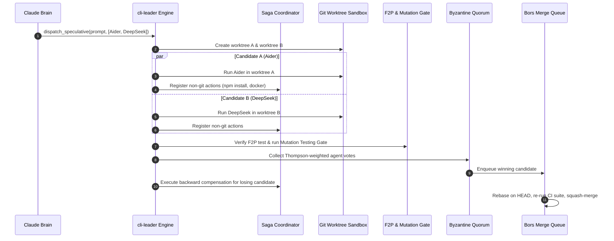

# System Architecture Deep Dive

## 1. Architectural Philosophy

`cli-leader` is designed around the principle of **Hierarchical Cognitive Orchestration & Resilient Systems**:
- High-level planning, architectural reasoning, and supervision are centralized into a single **Executive Brain** (Claude CLI).
- Concrete code editing, terminal commands, unit test generation, and deep repository indexing are delegated to specialized **Worker CLIs**.
- **Erlang/OTP Supervision & Temporal Durability**: Worker processes are supervised through OTP-style restart trees with fate-sharing boundaries. All workflow events are persisted to a SQLite WAL event log, enabling crash-proof resumption with zero token waste.
- **Git is the Execution Engine, Sagas Protect the Host**: All code mutations occur in isolated Git worktrees, while non-git side effects (package installs, database migrations, Docker daemons) are tracked via a Saga compensation stack for automatic backward rollback.
- **Objective Verification**: Natural language claims have zero weight. Code must pass Fail-to-Pass (F2P) verification, AST mutation gates (`cargo-mutants` style), and Byzantine quorum consensus before reaching the Bors-style Refinery merge queue.

---

## 2. Component Architecture

```
┌────────────────────────────────────────────────────────────────────────┐
│                        cli-leader Daemon (Go)                          │
│                                                                        │
│  ┌───────────────────────┐              ┌───────────────────────────┐  │
│  │ Multi-Provider Router │              │   Model Context Protocol  │  │
│  │  (Anthropic -> Any)   │              │   & Agent Client Protocol │  │
│  └──────────▲────────────┘              └─────────────▲─────────────┘  │
│             │ HTTP                                    │ JSON-RPC       │
│  ┌──────────▼────────────┐              ┌─────────────▼─────────────┐  │
│  │ Claude CLI (The Brain)│◄────────────►│ Dual-Ledger State Machine │  │
│  └───────────────────────┘              │ (Temporal Durable Replay) │  │
│                                         └─────────────┬─────────────┘  │
│                                                       │ OTP Trees      │
│  ┌──────────────────────────────────────────────┐     │                │
│  │ Ever-Learning Cognitive Bank                 │◄────┤                │
│  │ - SQLite Episodic Ledger (WAL)               │     ▼                │
│  │ - Tree-Sitter PageRank Repo Map              │ ┌──────────────────┐ │
│  │ - Dynamic Scoped Rules (.cursor/rules/*.mdc) │ │ OTP Supervisor   │ │
│  │ - Hermes Self-Evolving Skills & SOUL.md      │ │ (one_for_one /   │ │
│  │ - Two-Stage Thompson Sampling Matrix         │ │  one_for_all)    │ │
│  └──────────────────────────────────────────────┘ └────────┬─────────┘ │
│                                                            │           │
│  ┌─────────────────────────────────────────────────────────▼────────┐  │
│  │ Speculative Execution, Sagas & Refinery Merge Queue              │  │
│  │ - Isolated Git Worktrees (Branch Racing)                         │  │
│  │ - Saga Coordinator (Non-Git Side-Effect Rollbacks)               │  │
│  │ - Fail-to-Pass (F2P) & Mutation Testing Gate                     │  │
│  │ - Byzantine Quorum Consensus (Machine Proof Receipts)            │  │
│  │ - Serialized Bors-Style Refinery Merge Queue                     │  │
│  └──────────────────────────────────────────────────────────────────┘  │
└────────────────────────────────────────────────────────────────────────┘
```

---

## 3. The 7 Core Subsystems

### Subsystem 1: The Executive Brain, MCP & Agent Client Protocol (ACP)
Claude CLI operates as an agentic supervisor connecting to `cli-leader`'s built-in **MCP (Model Context Protocol)** server over stdio or local SSE. Furthermore, `cli-leader` implements the **Agent Client Protocol (ACP)**—co-authored by Zed Industries and JetBrains—allowing the daemon to plug directly into modern IDEs.

To prevent infinite loops and context contamination, `cli-leader` enforces:
1. **Dual-Ledger Pattern**:
   - **Task Ledger (`tasks`)**: Immutable record of the user's high-level goal, architectural constraints, and acceptance criteria.
   - **Progress Ledger (`task_steps`)**: Dynamic state machine tracking sub-step statuses (`pending`, `running`, `reviewing`, `completed`, `failed`).
2. **Temporal-Grade Durable Replay**:
   - All state transitions and tool outputs are recorded in an append-only SQLite WAL table (`workflow_events`).
   - If the daemon crashes, the host reboots, or network drops occur, `cli-leader` replays the workflow state deterministically: completed tool activities return instantly from the replay cache with **zero duplicate LLM tokens spent**.
3. **Loop & Stall Prevention**:
   - Cryptographic state hashing (`SHA256(tool + args + diff)`) and progress stall counters break circular repair thrashing after 3 iterations.
4. **Boomerang Subtasks**:
   - Sub-workers never inherit Claude Brain's full conversation transcript. They execute in fresh context and return typed **Boomerang Result Packets** (<250 tokens: diff stats, rationale, verification exit codes).

---

### Subsystem 2: Go Multi-Provider Gateway (Anthropic Protocol Emulator)
Claude CLI natively expects the Anthropic `/v1/messages` endpoint. `cli-leader` embeds an ultra-low-latency HTTP proxy in Go listening on `localhost:8082`.

#### Key Protocol Translation Mechanics:
1. **Zero-Allocation SSE Streaming Engine**:
   - Translates upstream OpenAI chunk deltas into framed Anthropic SSE envelopes (`content_block_start` $\to$ `content_block_delta` $\to$ `content_block_stop` $\to$ `message_stop`).
   - Uses `github.com/tidwall/gjson` and `sjson` directly on raw byte slices, achieving **<100 µs TTFT overhead** without reflection allocations.
2. **Reasoning Block Preservation**:
   - Bidirectionally maps DeepSeek-R1 `reasoning_content` to Anthropic `thinking` blocks (`thinking_delta`).
   - Retains reasoning blocks and cryptographic signatures during multi-turn replay.
3. **Tool Calling & Multi-Turn Role Decomposition**:
   - Decomposes mixed Anthropic user turns (text + tool results) into distinct `tool` messages followed by a trailing `user` message for OpenAI compatibility.
   - Converts tool schemas (`input_schema` $\to$ `parameters`) and sanitizes tool names for Gemini (`^[a-zA-Z_][a-zA-Z0-9_]*$`).
4. **Mandatory Local Token Counting**:
   - Serves `POST /v1/messages/count_tokens` locally via pure-Go `tiktoken-go` (BPE tokenizer), eliminating pre-flight latency.

---

### Subsystem 3: Worker Process Engine & Erlang OTP Supervision Trees
Worker CLIs often assume an interactive terminal (requiring ANSI colors, VT100 escapes, or user confirmation prompts like `[y/N]`).

#### OTP Supervision Topology:
* **"Let It Crash" Philosophy**: Never attempt defensive recovery from corrupted worker states. Fail fast and reset the worker worktree to a clean commit SHA.
* **Supervision Topologies**:
  - `one_for_one`: Isolated candidate workers in Branch Racing. If Worker A segfaults, Worker B continues unaffected.
  - `one_for_all`: Compound worker bundles (PTY Master + Subprocess + Auto-Reply Interceptor + Ring Buffer). If the CLI dies, the entire bundle terminates cleanly without zombie goroutines.
  - `rest_for_one`: Linear dependency pipelines (Worktree Setup $\to$ F2P Baseline Test $\to$ Worker CLI $\to$ Adversarial Audit).
* **Restart Intensity Escalation**:
  - If a worker crashes more than $M$ times in $T$ seconds (e.g., 3 crashes in 30s), the supervisor crashes itself and escalates an `escalated_failure` event to Claude Brain for re-planning.
* **PTY & Process Group Teardown**:
  - Uses `creack/pty.StartWithSize` with `Setsid: true` and Linux `Pdeathsig = syscall.SIGTERM`.
  - Escalates teardown: `SIGTERM` on `-pgid`, 3-second grace period, `SIGKILL` on `-pgid`.
* **High-Throughput 60 FPS TUI Decoupling**:
  - PTY output is captured in a circular ring buffer (`RingLogBuffer`) and flushed to Bubble Tea via a **30Hz ticker batcher**, preventing UI lockup during high-throughput logs.

---

### Subsystem 4: Speculative Branch Racing & Saga Coordinator


1. **Speculative Multi-Worktree Execution ("Branch Racing")**:
   - Concurrently spawns multiple workers in separate worktrees (`.brain/worktrees/<task-id>-a` and `<task-id>-b`).
   - Automatically selects the winning patch based on test results and diff complexity.
2. **Saga Coordinator for Non-Git Side Effects**:
   - Maintains a LIFO compensation stack for non-git mutations (`npm install`, database migrations, Docker containers, cloud resources).
   - If a speculative candidate loses or an operation fails, the Saga coordinator executes compensating actions in reverse order ($C_n \to C_1$), restoring the host to a pristine state.
3. **Bors-Style Refinery Merge Queue**:
   - Completed worktrees are queued into the Refinery. The Refinery checks out a temporary staging branch from latest `HEAD`, applies the squashed diff, runs CI tests, and merges only upon zero exit codes.

---

### Subsystem 5: Fail-to-Pass (F2P), Mutation Testing & Byzantine Quorum

1. **Fail-to-Pass (F2P) Protocol**:
   - Step 1: Reproduction test is generated and executed on unmodified HEAD; it **MUST FAIL** (ruling out false positives).
   - Step 2: Fix is implemented in worktree.
   - Step 3: Reproduction test **MUST PASS**; full regression suite **MUST PASS**.
2. **Mutation Testing Verification Gate (`cargo-mutants` style)**:
   - Injects synthetic AST defects into the modified code (inverting booleans, substituting default return values, removing statements).
   - **Killed Mutant**: Test suite fails (proves the test actually checks logic).
   - **Survived Mutant**: Test suite passes despite mutated code (detects hollow/tautological assertions).
   - Survived mutants trigger automated follow-up test synthesis.
3. **Byzantine Quorum Consensus**:
   - Zero trust for unverified claims. Approvals require verifiable machine proof receipts:
     * Subprocess exit code `0`.
     * Git diff hash matching proposed commit.
     * F2P test receipts showing pre-failure and post-pass.
     * Static analysis zero-error output.
   - Reviewer votes are weighted by their historical Bayesian score: $\mathbb{E}[\text{Beta}(\alpha, \beta)]$.

---

### Subsystem 6: Ever-Learning Cognitive Memory Bank

```mermaid
graph LR
    subgraph CognitiveBank [Ever-Learning Cognitive Bank]
        Episodic[1. Episodic WAL Ledger\nTasks, Diffs, Replay Cache]
        RepoMap[2. Tree-Sitter Repo Map\nPersonalized PageRank]
        Reflexion[3. Reflexion Engine\nVerbal Reinforcement]
        Rules[4. Scoped Rules\n.cursor/rules/*.mdc]
        Skills[5. Hermes Evolving Skills\n.brain/skills/*.yaml]
        Vectors[6. Pure-Go Vector Store\nchromem-go Embeddings]
        Matrix[7. Two-Stage Router\nCentroids + Thompson Sampling]
    end

    Failure[Test / Mutation Failure] --> Reflexion
    Reflexion -->|Extract Rule [WHEN-DO-BECAUSE]| Rules
    Rules -->|Embed Directive| Vectors
    Success[Novel Multi-Step Workflow] --> Skills
    TaskPrompt[Incoming Task Prompt] --> RepoMap
    TaskPrompt --> Matrix
```

1. **Episodic WAL Ledger (`modernc.org/sqlite`)**:
   - Zero-CGO pure Go database tracking full task metadata, git diff hashes, execution durations, token costs, and durable replay events.
2. **Tree-Sitter PageRank Repo Map**:
   - Extracts definition and reference tags using Tree-Sitter Go bindings (`smacker/go-tree-sitter`).
   - Runs Personalized PageRank over the symbol graph, outputting an ultra-dense, token-budgeted (<1024 tokens) codebase structural map to Claude Brain.
3. **Reflexion Verbal Reinforcement Loop**:
   - Converts binary errors into actionable natural language directives:
     * *Failure*: `panic: runtime error: invalid memory address in gateway/proxy.go:84`
     * *Directive*: `"When forwarding Anthropic SSE delta events, ensure the response body writer is not nil before flushing chunks."`
4. **Scoped Dynamic Rules (`.cursor/rules/*.mdc`)**:
   - Follows the Cursor `.mdc` format with YAML frontmatter (`globs`, `description`, `alwaysApply`). Injected dynamically into worker prompts based on file glob matches, capped strictly at **<800 tokens**.
5. **Hermes Self-Evolving Skills (`.brain/skills/*.yaml`)**:
   - When a worker CLI executes a successful novel multi-step workflow (e.g. custom Docker compose setup or migration), `cli-leader` codifies it into a reusable executable skill macro.
6. **OpenClaw `SOUL.md` & Webhook Channels**:
   - Defines the Brain's behavioral identity, risk tolerance, and principles in a human-readable `.brain/SOUL.md`.
   - Dispatches async notifications to Slack, Discord, or Telegram when long-running branch races finish or require human approval.
7. **Two-Stage Routing Engine**:
   - *Stage 1*: Sub-5ms semantic centroid vector routing (`chromem-go`) classifying task category.
   - *Stage 2*: Bayesian Thompson Sampling $\text{Beta}(\alpha, \beta)$ selecting the optimal worker CLI.

---

### Subsystem 7: Tiered Workspace Sandboxing
1. **Tier 1 (Preferred): Bubblewrap (`bwrap`)**:
   - Unprivileged Linux namespace isolation (`--ro-bind / /`, `--bind <worktree> <worktree>`, `--tmpfs /tmp`, `--unshare-pid`, `--unshare-net`).
2. **Tier 2 (Zero-Dependency Fallback): Linux Landlock LSM**:
   - Self-re-exec trampoline (`cli-leader __sandbox_exec`) applying irreversible Landlock path rules with <1ms overhead.
