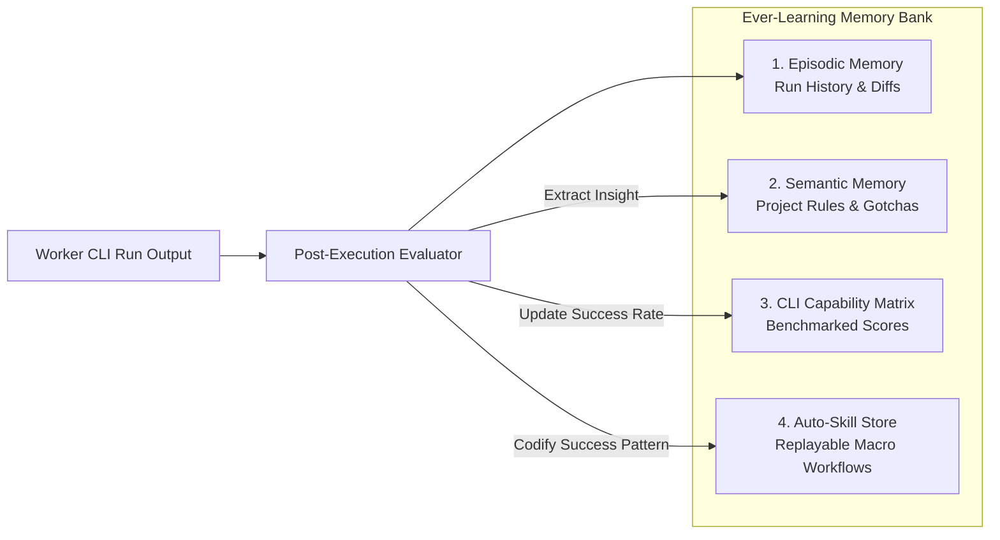

# System Architecture Deep Dive

## 1. Architectural Philosophy

`cli-leader` is designed around the principle of **Hierarchical Cognitive Orchestration**:
- High-level planning, architectural reasoning, and supervision are centralized into a single **Executive Brain** (Claude CLI).
- Concrete code editing, terminal commands, unit test generation, and deep repository indexing are delegated to specialized **Worker CLIs**.
- A **Central Cognitive Memory** links every worker to the Brain, turning ephemeral CLI executions into permanent, compounding institutional knowledge.

---

## 2. Component Architecture

```
┌────────────────────────────────────────────────────────────────────────┐
│                        cli-leader Daemon (Go)                          │
│                                                                        │
│  ┌───────────────────────┐              ┌───────────────────────────┐  │
│  │ Multi-Provider Router │              │   Model Context Protocol  │  │
│  │  (Anthropic -> Any)   │              │        MCP Server         │  │
│  └──────────▲────────────┘              └─────────────▲─────────────┘  │
│             │ HTTP                                    │ JSON-RPC       │
│  ┌──────────▼────────────┐              ┌─────────────▼─────────────┐  │
│  │ Claude CLI (The Brain)│◄────────────►│ Worker Dispatcher Engine  │  │
│  └───────────────────────┘              └─────────────┬─────────────┘  │
│                                                       │ Goroutines     │
│  ┌──────────────────────────────────────────────┐     │                │
│  │ Ever-Learning Memory Bank                    │◄────┤                │
│  │ - Episodic Memory (Task Logs & Diffs)        │     ▼                │
│  │ - Semantic Memory (Rules & Conventions)      │ ┌──────────────────┐ │
│  │ - CLI Capability Matrix (Profiler & Router)  │ │ Worker Subprocess│ │
│  │ - Skill Repository (Auto-Generated Workflows)│ │ (Aider, Gemini,  │ │
│  └──────────────────────────────────────────────┘ │  Ollama, etc.)   │ │
│                                                   └──────────────────┘ │
└────────────────────────────────────────────────────────────────────────┘
```

---

## 3. The 5 Core Subsystems

### Subsystem 1: The Executive Brain & MCP Control Plane
Claude CLI operates as an agentic supervisor by connecting to `cli-leader`'s built-in **MCP (Model Context Protocol)** server over stdio or local SSE.

#### MCP Tool Catalog Exposed to Claude CLI:
1. `dispatch_worker(cli_name, task_prompt, target_files, flags)`:
   - Starts an isolated worker CLI task. Returns an asynchronous `task_id`.
2. `get_task_status(task_id)`:
   - Polls execution state, streaming output buffers, execution progress, and resource consumption.
3. `inspect_diff(task_id)`:
   - Returns the exact `git diff` generated by the worker inside its isolated worktree.
4. `accept_or_reject_task(task_id, decision, reason)`:
   - Merges the worktree branch into the main branch or discards it with post-mortem logs.
5. `query_brain_memory(query, category)`:
   - Retrieves learned rules, previous failure modes, and best practices relevant to the current task.
6. `record_learning(lesson_type, rule, context)`:
   - Commits a synthesized rule or bug fix into the permanent knowledge base.

---

### Subsystem 2: Go Multi-Provider Gateway (Anthropic Protocol Emulator)
Claude CLI natively expects the Anthropic `/v1/messages` endpoint. `cli-leader` embeds an ultra-low-latency HTTP proxy in Go listening on `localhost:8082`.

#### Flow:
1. Claude CLI sends an Anthropic-formatted request:
   ```json
   {
     "model": "claude-3-7-sonnet-20250219",
     "messages": [{"role": "user", "content": "..."}],
     "tools": [...]
   }
   ```
2. The Go Gateway intercepts the request, checks configuration mappings, and dynamically translates:
   - **For OpenAI**: Translates `messages` + `tools` to OpenAI Chat Completions or Assistants format. Streams SSE chunks back as Anthropic `content_block_delta` events.
   - **For Google Gemini**: Translates system prompts, function calls, and content parts to the Gemini REST API format.
   - **For Ollama / DeepSeek**: Translates to local OpenAI-compatible endpoints.
3. Streams the response back to Claude CLI in strict Anthropic SSE format.

**Result**: Claude CLI runs seamlessly with zero modifications against any LLM provider.

---

### Subsystem 3: Worker Process Engine & PTY Supervision
Worker CLIs often assume an interactive terminal (requiring ANSI colors, VT100 escapes, or user confirmation prompts like `y/n`).

#### Go Implementation Details:
* **PTY Virtualization**: Uses `creack/pty` in Go to allocate pseudo-terminals for CLI workers that refuse non-interactive standard pipes.
* **Auto-Responder & Guardrails**:
  - The process engine intercepts standard interactive prompts (e.g. `Do you want to apply these changes? [y/N]`) and applies configured safety rules.
* **Timeout & Resource Limiter**:
  - Each worker runs under a `context.WithTimeout`.
  - Process group killing (`syscall.Kill(-pgid, syscall.SIGKILL)`) guarantees no orphaned CLI processes remain running.

---

### Subsystem 4: Ever-Learning Cognitive Memory Bank
The learning system operates on four interconnected layers:



1. **Episodic Memory**:
   - Stores raw task invocations, worker stdout/stderr, git diff hashes, execution durations, and exit codes in a fast SQLite database.
2. **Semantic Memory (Rules Engine)**:
   - When a worker encounters and fixes an error (or is corrected by the user/leader), a concise directive is generated (e.g., `"When modifying routing in Gin, register middleware before group declarations"`).
   - Saved in `.brain/conventions.md` and indexed with embeddings for fast semantic lookup.
3. **CLI Capability Matrix**:
   - Dynamically profiles connected CLIs across categories:
     - `repo_indexing`: Gemini CLI (1M context) -> 98%
     - `targeted_refactor`: Aider -> 94%
     - `unit_test_generation`: DeepSeek / Ollama -> 91%
   - When the Brain requests a worker, the matrix recommends the optimal tool for price, latency, and historical accuracy.
4. **Auto-Skill Store**:
   - Complex multi-step sequences that achieve reliable results are saved as executable templates (`.brain/skills/*.yaml`).

---

### Subsystem 5: Sandboxing & Adversarial Peer Review
To prevent code destruction and catch bugs before human review:

1. **Git Worktree Isolation**:
   - Every worker runs inside a detached `git worktree` located at `.brain/worktrees/<task-id>`.
   - The worker has zero access to the working tree of the developer until explicitly approved.
2. **Red Team / Blue Team Peer Review**:
   - **Phase 1 (The Builder)**: Worker A generates code changes.
   - **Phase 2 (The Breaker)**: An adversarial worker CLI is spawned with instructions: *"Inspect the git diff from Worker A. Attempt to write failing unit tests, identify memory leaks, security issues, or edge-case violations."*
   - **Phase 3 (Arbitration)**: If tests fail or vulnerabilities are found, the diff is rejected and Worker A is instructed to fix the highlighted issues.
   - **Phase 4 (Merge)**: Once verified, the worktree is squashed and merged into the active branch.
