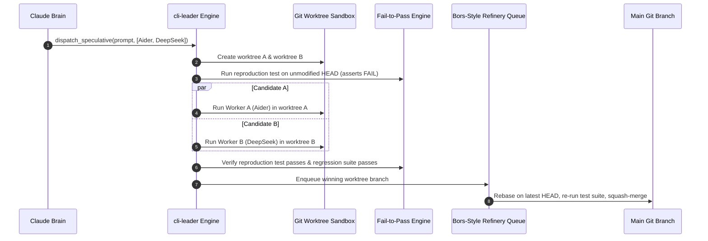

# System Architecture Deep Dive

## 1. Architectural Philosophy

`cli-leader` is designed around the principle of **Hierarchical Cognitive Orchestration**:
- High-level planning, architectural reasoning, and supervision are centralized into a single **Executive Brain** (Claude CLI).
- Concrete code editing, terminal commands, unit test generation, and deep repository indexing are delegated to specialized **Worker CLIs**.
- A **Central Cognitive Memory** links every worker to the Brain, turning ephemeral CLI executions into permanent, compounding institutional knowledge.
- **Git is the Execution Engine**: All worker operations are isolated in ephemeral Git worktrees, verified through Fail-to-Pass (F2P) protocols, and merged via a serialized Refinery queue.

---

## 2. Component Architecture

```
┌────────────────────────────────────────────────────────────────────────┐
│                        cli-leader Daemon (Go)                          │
│                                                                        │
│  ┌───────────────────────┐              ┌───────────────────────────┐  │
│  │ Multi-Provider Router │              │   Model Context Protocol  │  │
│  │  (Anthropic -> Any)   │              │        MCP Server         │  │
│  └──────────▲────────────┘              └─────────────▲─────────────┘  │
│             │ HTTP                                    │ JSON-RPC       │
│  ┌──────────▼────────────┐              ┌─────────────▼─────────────┐  │
│  │ Claude CLI (The Brain)│◄────────────►│ Dual-Ledger State Machine │  │
│  └───────────────────────┘              │  (Task & Progress Ledger) │  │
│                                         └─────────────┬─────────────┘  │
│                                                       │ Goroutines     │
│  ┌──────────────────────────────────────────────┐     │                │
│  │ Ever-Learning Cognitive Bank                 │◄────┤                │
│  │ - Episodic Task Ledger (SQLite)              │     ▼                │
│  │ - Reflexion Verbal Learning Engine           │ ┌──────────────────┐ │
│  │ - Dynamic Scoped Rules (.cursor/rules/*.mdc) │ │ Worker Subprocess│ │
│  │ - Pure-Go Vector Memory (chromem-go)         │ │ Engine (PTY +    │ │
│  │ - Thompson Sampling Capability Matrix        │ │ Pdeathsig)       │ │
│  └──────────────────────────────────────────────┘ └────────┬─────────┘ │
│                                                            │           │
│  ┌─────────────────────────────────────────────────────────▼────────┐  │
│  │ Speculative Execution & Refinery Merge Queue                     │  │
│  │ - Isolated Git Worktrees (Branch Racing)                         │  │
│  │ - Fail-to-Pass (F2P) Automated TDD Verification                  │  │
│  │ - Serialized Bors-Style Refinery Merge Queue                     │  │
│  └──────────────────────────────────────────────────────────────────┘  │
└────────────────────────────────────────────────────────────────────────┘
```

---

## 3. The 6 Core Subsystems

### Subsystem 1: The Executive Brain & Dual-Ledger State Machine
Claude CLI operates as an agentic supervisor connecting to `cli-leader`'s built-in **MCP (Model Context Protocol)** server over stdio or local SSE.

To prevent infinite loops and context contamination, `cli-leader` enforces the **Dual-Ledger Pattern**:
1. **Task Ledger (`tasks`)**: Immutable record of the user's high-level goal, architectural constraints, and acceptance criteria.
2. **Progress Ledger (`task_steps`)**: Dynamic state machine tracking sub-step statuses (`pending`, `running`, `reviewing`, `completed`, `failed`), assigned worker CLIs, and retry counts.

#### Loop & Thrashing Prevention:
- **Cryptographic State Hashing**: Hashes `(tool_name, tool_arguments)` and `(git diff hash)`. If a worker repeats identical tool invocations or generates 0-byte diffs twice, `cli-leader` aborts the subtask and injects a loop-break warning: *"Action produced no state change. Re-evaluate approach."*
- **Stall Counters**: If 3 consecutive turns yield no progress against the acceptance criteria, the subtask is terminated, the worktree is wiped, and the Brain triggers an architectural re-plan.
- **Context Isolation**: Workers **never inherit raw conversational transcripts**. The Brain passes a concise, typed context packet (goal, file globs, AST signatures, negative rules) and receives an unambiguous `git diff` in return.

#### MCP Tool Catalog Exposed to Claude CLI:
1. `dispatch_worker(cli_name, task_prompt, target_files, flags)`: Starts an isolated worker CLI task; returns asynchronous `task_id`.
2. `dispatch_speculative(prompt, candidates[], target_files)`: Spawns parallel candidate workers in separate worktrees ("Branch Racing").
3. `get_task_status(task_id)`: Streams progress, stdout ring buffer lines, and resource usage.
4. `inspect_diff(task_id)`: Returns the unified `git diff` produced in the worker's isolated worktree.
5. `verify_f2p(task_id, reproduction_test_cmd)`: Runs Fail-to-Pass test assertions.
6. `refinery_enqueue(task_id, commit_message)`: Enqueues a verified worktree into the Bors-style merge queue.
7. `query_brain_memory(query, category)`: Hybrid vector + lexical search across project rules and past post-mortems.
8. `record_learning(lesson_type, rule_directive, globs)`: Commits a newly synthesized `.mdc` rule.

---

### Subsystem 2: Go Multi-Provider Gateway (Anthropic Protocol Emulator)
Claude CLI natively expects the Anthropic `/v1/messages` endpoint. `cli-leader` embeds an ultra-low-latency HTTP proxy in Go listening on `localhost:8082`.

#### Key Protocol Translation Mechanics:
1. **SSE Streaming State Machine**:
   - Anthropic mandates explicit lifecycle events (`message_start` $\to$ `content_block_start` $\to$ multiple `content_block_delta` $\to$ `content_block_stop` $\to$ `message_delta` $\to$ `message_stop`).
   - The Go gateway tracks active block types (`thinking`, `text`, `tool_use`) and indexes, converting loose OpenAI streaming chunks into strictly framed Anthropic SSE envelopes.
2. **DeepSeek-R1 & Reasoning Translation**:
   - Maps upstream `reasoning_content` to Anthropic `thinking` blocks (`thinking_delta`).
   - Retains reasoning blocks in multi-turn request replay (required by DeepSeek-R1).
3. **Tool Calling & Multi-Turn Asymmetry**:
   - Anthropic sends tool results within a `user` message as `tool_result` content blocks. OpenAI strictly requires `role: "tool"` with matching `tool_call_id`.
   - The gateway decomposes mixed user messages (text + tool results) into distinct `tool` messages followed by a trailing `user` message.
   - Translates tool definitions between Anthropic `input_schema` and OpenAI/Gemini `parameters`. Sanitizes tool names for Gemini regex (`^[a-zA-Z_][a-zA-Z0-9_]*$`).
4. **Mandatory Token Counting Endpoint**:
   - Serves `POST /v1/messages/count_tokens` locally using pure-Go BPE tokenization (`tiktoken-go`), preventing Claude CLI from aborting on pre-flight checks.
5. **Zero-Allocation JSON Parsing**:
   - Uses `github.com/tidwall/gjson` and `sjson` to strip unsupported fields (e.g. `cache_control`) and mutate payloads without expensive struct reflections.

---

### Subsystem 3: Worker Process Engine & PTY Supervision
Worker CLIs often assume an interactive terminal (requiring ANSI colors, VT100 escapes, or user confirmation prompts like `[y/N]`).

#### Go Implementation Details:
* **PTY Virtualization**: Uses `creack/pty.StartWithSize` (30 rows, 120 cols) to allocate pseudo-terminals (`/dev/pts/*`), satisfying `isatty(3)` checks across all tools.
* **Process Group Isolation & Teardown**:
  - Sets `cmd.SysProcAttr.Setsid = true` (or `Setpgid = true`), making the worker the leader of its own process group.
  - Sets `SysProcAttr.Pdeathsig = syscall.SIGTERM` so the Linux kernel automatically terminates child processes if `cli-leader` exits unexpectedly.
  - Escalates teardown: sends `syscall.Kill(-pgid, syscall.SIGTERM)`, waits 3 seconds, and forces `syscall.Kill(-pgid, syscall.SIGKILL)`.
* **Automated Prompt Responders**:
  - Implements a non-blocking sliding-window regex interceptor over the PTY stream to detect interactive confirmation prompts (e.g. `[y/N]`, `Apply changes?`) and automatically reply with `y\n`.
* **High-Throughput 60 FPS TUI Decoupling**:
  - PTY output is appended to a thread-safe circular ring buffer (`RingLogBuffer`).
  - A 30Hz ticker batcher drains accumulated lines into a single `LogBatchMsg` for Bubble Tea, eliminating UI freezing during high-output commands.

---

### Subsystem 4: Speculative Execution, F2P Verification & Refinery Queue



1. **Speculative Multi-Worktree Execution ("Branch Racing")**:
   - For challenging tasks, `cli-leader` spawns multiple worker CLIs concurrently in separate worktrees (`.brain/worktrees/<task-id>-a` and `<task-id>-b`).
   - Both run verification; the patch with the lowest diff complexity and cleanest test run is selected.
2. **Fail-to-Pass (F2P) Protocol**:
   - Before editing code, a reproduction test is executed. It **MUST FAIL** on unmodified code (ruling out false positives).
   - After the fix is applied, the reproduction test **MUST PASS**.
   - The full existing test suite (`go test ./...` or `npm test`) **MUST PASS** (ruling out regressions).
3. **Bors-Style Refinery Merge Queue**:
   - Eliminates merge races when multiple workers complete concurrently.
   - Completed worktrees are queued into the Refinery. The Refinery checks out a temporary staging branch from latest `HEAD`, applies the squashed diff, runs CI tests, and merges only upon zero exit codes.

---

### Subsystem 5: Ever-Learning Cognitive Memory Bank

```mermaid
graph LR
    subgraph CognitiveBank [Ever-Learning Cognitive Bank]
        Episodic[1. Episodic Ledger\nSQLite Tasks & Diffs]
        Reflexion[2. Reflexion Engine\nVerbal Reinforcement]
        Rules[3. Scoped Rules\n.cursor/rules/*.mdc]
        Vectors[4. Pure-Go Vector Store\nchromem-go Embeddings]
        Matrix[5. Dynamic Capability Matrix\nThompson Sampling Beta Dist]
    end

    WorkerFailure[Test / Compiler Failure] --> Reflexion
    Reflexion -->|Extract Rule [WHEN-DO-BECAUSE]| Rules
    Rules -->|Embed Directive| Vectors
    WorkerSuccess[Verified Task Merge] --> Episodic
    WorkerSuccess -->|Increment Alpha (+1)| Matrix
    WorkerFailure -->|Increment Beta (+1)| Matrix
```

1. **Episodic Ledger (`modernc.org/sqlite`)**:
   - Zero-CGO pure Go database tracking full task metadata, git diff hashes, execution durations, token costs, and exit codes.
2. **Reflexion Verbal Reinforcement Loop**:
   - Converts binary failures into actionable natural language directives:
     * *Failure Trace*: `panic: runtime error: invalid memory address in gateway/proxy.go:84`
     * *Verbal Directive*: `"When forwarding Anthropic SSE delta events, ensure the response body writer is not nil before flushing chunks."`
3. **Scoped Dynamic Rules (`.cursor/rules/*.mdc`)**:
   - Rules follow the modern Cursor `.mdc` format with YAML frontmatter (`globs`, `description`, `alwaysApply`).
   - Injected dynamically into worker prompts based on file glob matches and semantic relevance, capped strictly at **<800 tokens** using pure-Go BPE token counting (`tiktoken-go`).
4. **Pure-Go In-Memory Vector Search (`chromem-go`)**:
   - Zero-CGO embedded vector store capable of searching 20,000 vectors in <2ms on a single CPU.
   - Implements Reciprocal Rank Fusion (RRF) merging exact lexical matches (SQLite FTS5) with semantic vector similarity.
5. **Thompson Sampling Capability Matrix**:
   - Tracks success/failure distributions using Bayesian Beta distributions:
     $$\theta_{w,c} \sim \text{Beta}(\alpha_{w,c}, \beta_{w,c})$$
   - Dynamically samples scores to balance **exploration** of newly installed local models (Ollama, DeepSeek) with **exploitation** of proven frontier models (Claude 3.7, o3-mini).

---

### Subsystem 6: Tiered Workspace Sandboxing
To ensure security without introducing heavy container dependencies:
1. **Tier 1 (Preferred): Bubblewrap (`bwrap`)**:
   - Unprivileged Linux namespace isolation.
   - Mounts root filesystem `/` strictly Read-Only (`--ro-bind / /`).
   - Mounts only the worker's assigned worktree as Read-Write (`--bind <worktree> <worktree>`).
   - Provides ephemeral in-RAM `/tmp` (`--tmpfs /tmp`) and isolates PID and network namespaces.
2. **Tier 2 (Zero-Dependency Fallback): Linux Landlock LSM**:
   - Employs a self-re-exec trampoline (`cli-leader __sandbox_exec`) using `github.com/landlock-lsm/go-landlock`.
   - The child process applies irreversible Landlock path restrictions (<1ms overhead) and drops privileges before executing the worker CLI via `syscall.Exec`.
