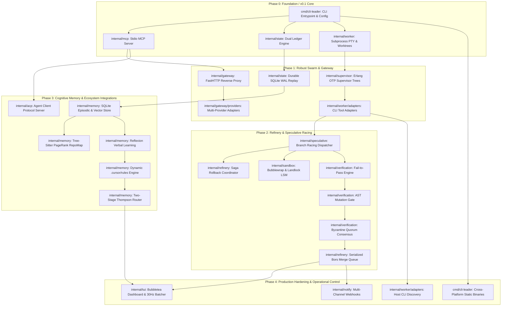

# Project Roadmap & Implementation Milestones

> **Specification Conformance**: This document strictly adheres to [CONTRACT.md](_review/CONTRACT.md). Every milestone feature has exactly one canonical status tag (`[v0.1 Core]`, `[Planned]`, or `[Research]`), maps directly to its canonical Go package under `github.com/01RG0/cli-leader` as defined in [GO_SPECIFICATION.md](GO_SPECIFICATION.md), and conforms to architectural boundaries set in [ARCHITECTURE.md](ARCHITECTURE.md).

---

## 1. Executive Summary & Delivery Strategy

`cli-leader` orchestrates autonomous worker CLIs under the cognitive supervision of an Executive Brain (Claude CLI). Development is executed across five sequential phases:

1. **Phase 0: Foundation / v0.1 Core `[v0.1 Core]`**: Minimum viable orchestration engine featuring stdio MCP tool dispatch, Dual Ledger state tracking, PTY worker subprocess execution, and native Git worktree isolation.
2. **Phase 1: Robust Swarm & Gateway `[Planned]`**: Low-latency FastHTTP reverse proxy gateway translating Anthropic `/v1/messages` to OpenAI/Gemini/Ollama, Erlang OTP supervision trees, and Temporal-grade SQLite WAL durable replay.
3. **Phase 2: Refinery & Speculative Racing `[Planned]`**: Speculative branch racing across parallel worktrees, LIFO compensating Saga coordination for non-git side effects, Fail-to-Pass (F2P) TDD verification, AST mutation testing gates, and Bors-style Refinery merge queue.
4. **Phase 3: Cognitive Memory & Ecosystem Integrations `[Planned]`**: Pure-Go SQLite memory bank, embedded vector search, Tree-Sitter PageRank RepoMap, Reflexion verbal learning loop, dynamic `.cursor/rules/*.mdc` injection, and Agent Client Protocol (ACP) JSON-RPC server for Zed and JetBrains IDEs.
5. **Phase 4: Production Hardening, Operational TUI & Autonomous Discovery `[Planned]`**: Charm Bubbletea mission control terminal dashboard with 30Hz log decoupling, multi-channel webhook notifications (Slack/Discord/Telegram), host CLI discovery, zero-shot adapter synthesis, and cross-platform static binary packaging.

---

## 2. Milestone Dependency Graph

---

## 3. Delivery Phases & Milestones

### Phase 0: Foundation / v0.1 Core `[v0.1 Core]`
*Target Completion Timeline*: `TODO(verify): Target calendar completion dates for Phase 0 through Phase 4` (refer to [ROADMAP.questions.md](_review/ROADMAP.questions.md#q-road-01-milestone-release-dates--target-schedule)).

The minimal viable orchestrator delivering single-worker execution driven by Claude CLI via stdio Model Context Protocol (MCP).

- [x] **Go Module & Application Entrypoint** `[v0.1 Core]`
  - Canonical Package: `cmd/cli-leader`
  - Specification Reference: [GO_SPECIFICATION.md Section 1](GO_SPECIFICATION.md#1-standard-project-layout)
  - Deliverable: Initialize `github.com/01RG0/cli-leader` module and Cobra command-line router supporting `cli-leader start` and configuration inspection.
- [x] **Configuration Loader Engine** `[v0.1 Core]`
  - Canonical Package: `internal/config`
  - Specification Reference: [GO_SPECIFICATION.md Section 3](GO_SPECIFICATION.md#3-configuration-schema-cli-leaderyaml)
  - Deliverable: Parse `cli-leader.yaml` and environment variable overrides for gateway listeners, worker adapters, supervisor limits, and sandboxing tiers.
- [x] **Model Context Protocol (MCP) Stdio Server** `[v0.1 Core]`
  - Canonical Package: `internal/mcp`
  - Specification Reference: [API_SPECIFICATION.md Section 2](API_SPECIFICATION.md#2-model-context-protocol-mcp-tool-schemas)
  - Deliverable: Stdio JSON-RPC 2.0 server exposing initial orchestrator tools (`dispatch_worker`) to Claude CLI.
- [x] **Dual-Ledger State Machine Baseline** `[v0.1 Core]`
  - Canonical Package: `internal/state`
  - Specification Reference: [ARCHITECTURE.md Subsystem 1](ARCHITECTURE.md#subsystem-1-the-executive-brain-mcp--agent-client-protocol-acp)
  - Deliverable: Implement `TaskLedger` (immutable user goals and constraints) and `ProgressLedger` (dynamic step execution statuses: pending, running, completed, failed).
- [x] **PTY Subprocess Execution Engine** `[v0.1 Core]`
  - Canonical Package: `internal/worker`
  - Specification Reference: [GO_SPECIFICATION.md Section 1](GO_SPECIFICATION.md#1-standard-project-layout)
  - Deliverable: Interactive subprocess execution via `creack/pty.StartWithSize` capturing ANSI streams from wrapped CLI tools.
- [x] **Native Git Worktree Isolation Manager** `[v0.1 Core]`
  - Canonical Package: `internal/worker`
  - Specification Reference: [ARCHITECTURE.md Subsystem 3](ARCHITECTURE.md#subsystem-3-worker-process-engine--erlang-otp-supervision-trees)
  - Deliverable: Automated creation and cleanup of isolated Git worktrees under `.brain/worktrees/<task-id>` with `sync.Mutex` serialization eliminating `.git/config.lock` collisions.

#### Phase 0 Deliverable Acceptance Criteria
1. Executing `cli-leader start --config cli-leader.example.yaml` loads configuration without error and initializes the stdio MCP server.
2. Claude CLI configured with `cli-leader` as an MCP server successfully discovers and inspects the `dispatch_worker` tool schema.
3. Invoking `dispatch_worker` provisions a fresh worktree, spawns the requested CLI in an isolated PTY session, captures terminal output, commits file modifications, and cleanly destroys the worktree.

---

### Phase 1: Robust Swarm Execution & Multi-Provider Gateway `[Planned]`
*Target Completion Timeline*: `TODO(verify): Target calendar completion dates for Phase 0 through Phase 4`.

Establishes the resilient multi-provider reverse proxy, Erlang OTP process supervision trees, and Temporal-grade durable event replay.

- [ ] **FastHTTP Anthropic Protocol Reverse Proxy** `[Planned]`
  - Canonical Package: `internal/gateway`
  - Specification Reference: [ARCHITECTURE.md Subsystem 2](ARCHITECTURE.md#subsystem-2-go-multi-provider-gateway-anthropic-protocol-emulator)
  - Deliverable: High-performance HTTP server listening on `:8082` intercepting Anthropic `/v1/messages` calls and streaming translated payloads to upstreams. Target (unmeasured): <100 µs streaming overhead without reflection allocations.
- [ ] **Pure-Go BPE Token Counting Endpoint** `[Planned]`
  - Canonical Package: `internal/gateway`
  - Specification Reference: [API_SPECIFICATION.md Section 1.1](API_SPECIFICATION.md#11-post-v1messagescount_tokens)
  - Deliverable: Local `POST /v1/messages/count_tokens` handler utilizing `pkoukk/tiktoken-go`, eliminating network roundtrip latency for Claude CLI pre-flight checks.
- [ ] **Zero-Allocation SSE Stream Translation Engine** `[Planned]`
  - Canonical Package: `internal/gateway`
  - Specification Reference: [ARCHITECTURE.md Subsystem 2](ARCHITECTURE.md#subsystem-2-go-multi-provider-gateway-anthropic-protocol-emulator)
  - Deliverable: Byte-slice stream state machine (`content_block_start` $\to$ `content_block_delta` $\to$ `content_block_stop` $\to$ `message_stop`) using `tidwall/gjson` and `tidwall/sjson`.
- [ ] **Multi-Provider Upstream Adapters** `[Planned]`
  - Canonical Package: `internal/gateway/providers`
  - Specification Reference: [GO_SPECIFICATION.md Section 1](GO_SPECIFICATION.md#1-standard-project-layout)
  - Deliverable: Provider translation implementations for OpenAI (`openai.go`), Gemini REST (`gemini.go`), and Ollama (`ollama.go`), including schema conversion (`input_schema` $\to$ `parameters`) and Gemini name sanitization.
- [ ] **DeepSeek Reasoning-to-Thinking Translation** `[Planned]`
  - Canonical Package: `internal/gateway/providers`
  - Specification Reference: [ARCHITECTURE.md Subsystem 2](ARCHITECTURE.md#subsystem-2-go-multi-provider-gateway-anthropic-protocol-emulator)
  - Deliverable: Bidirectional mapping of DeepSeek-R1 `reasoning_content` to Anthropic `thinking` blocks, preserving cryptographic signatures across multi-turn sessions.
- [ ] **Erlang OTP Process Supervision Trees** `[Planned]`
  - Canonical Package: `internal/supervisor`
  - Specification Reference: [GO_SPECIFICATION.md Section 2.1](GO_SPECIFICATION.md#21-erlang-otp-supervisor-tree)
  - Deliverable: Implement Erlang/Elixir-style supervisor trees via `thejerf/suture/v4` with `one_for_one` strategy for isolated workers, `one_for_all` for fate-sharing bundles, and restart intensity escalation ($M$ crashes in $T$ seconds) bubbling to Claude Brain.
- [ ] **Process Group Isolation & Lifecycle Teardown** `[Planned]`
  - Canonical Package: `internal/worker`
  - Specification Reference: [ARCHITECTURE.md Subsystem 3](ARCHITECTURE.md#subsystem-3-worker-process-engine--erlang-otp-supervision-trees)
  - Deliverable: POSIX process group isolation (`Setsid: true`, `Pdeathsig = SIGTERM`) with staged termination (`SIGTERM` followed by grace period then `SIGKILL` on `-pgid`).
- [ ] **Sliding-Window Regex Prompt Auto-Responder** `[Planned]`
  - Canonical Package: `internal/worker`
  - Specification Reference: [GO_SPECIFICATION.md Section 1](GO_SPECIFICATION.md#1-standard-project-layout)
  - Deliverable: Regex scanner detecting interactive confirmation prompts (e.g. `[y/N]`, `Apply changes?`) and dispatching pre-configured automated responses to PTY stdin.
- [ ] **Built-in Worker CLI Adapters** `[Planned]`
  - Canonical Package: `internal/worker/adapters`
  - Specification Reference: [GO_SPECIFICATION.md Section 1](GO_SPECIFICATION.md#1-standard-project-layout)
  - Deliverable: Specialized adapters for `aider`, `gemini_cli`, `ollama_cli`, and generic CLI executables.
- [ ] **Temporal-Grade SQLite WAL Durable Event Engine** `[Planned]`
  - Canonical Package: `internal/state`
  - Specification Reference: [API_SPECIFICATION.md Section 4](API_SPECIFICATION.md#4-sqlite-wal-durable-event-sourcing-schema)
  - Deliverable: Append-only `workflow_events` event sourcing table in SQLite WAL mode. Target (unmeasured): zero duplicate LLM tokens spent during crash recovery and workflow resumption.
- [ ] **Cryptographic State Hashing Stall Detector** `[Planned]`
  - Canonical Package: `internal/state`
  - Specification Reference: [ARCHITECTURE.md Subsystem 1](ARCHITECTURE.md#subsystem-1-the-executive-brain-mcp--agent-client-protocol-acp)
  - Deliverable: `SHA256(tool + args + diff)` cryptographic hashing and loop breaker halting execution when an agent repeats states without forward progress for >3 turns.
- [ ] **Boomerang Subtask Packet Squashing** `[Planned]`
  - Canonical Package: `internal/worker`
  - Specification Reference: [ARCHITECTURE.md Subsystem 1](ARCHITECTURE.md#subsystem-1-the-executive-brain-mcp--agent-client-protocol-acp)
  - Deliverable: Worker output compression returning typed summaries (diff statistics, exit codes, rationale). Target (unmeasured): Boomerang subtask packet squashing to <250 tokens.

#### Phase 1 Deliverable Acceptance Criteria
1. Claude CLI configured with `ANTHROPIC_BASE_URL=http://localhost:8082` executes full multi-turn conversational tool workflows backed by OpenAI (`gpt-4o`, `o3-mini`) and Ollama (`deepseek-r1`) models.
2. Token counting endpoint `/v1/messages/count_tokens` answers accurately within local CPU latency bounds without outbound network calls.
3. Terminating `cli-leader` daemon via `SIGKILL` during active task execution followed by restart results in deterministic state replay from SQLite WAL without re-issuing duplicate requests.
4. Worker subprocess generating an interactive `[y/N]` prompt is automatically unblocked by the auto-responder within 50ms.
5. Simulated crash of a worker bundle triggers OTP `one_for_all` teardown, restarting child processes up to configured intensity limits before escalating to Claude Brain.

---

### Phase 2: Refinery & Speculative Branch Racing `[Planned]`
*Target Completion Timeline*: `TODO(verify): Target calendar completion dates for Phase 0 through Phase 4`.

Implements speculative execution, rollback safety for non-git side effects, and strict objective verification gates before merging code.

- [ ] **Speculative Multi-Worktree Execution ("Branch Racing")** `[Planned]`
  - Canonical Package: `internal/speculative`
  - Specification Reference: [ARCHITECTURE.md Subsystem 4](ARCHITECTURE.md#subsystem-4-speculative-branch-racing--saga-coordinator)
  - Deliverable: Concurrent dispatch of alternative task prompts or diverse worker CLIs across isolated worktrees via `dispatch_speculative` tool, selecting the winning candidate based on objective test verification.
- [ ] **Saga Non-Git Side-Effect Coordinator** `[Planned]`
  - Canonical Package: `internal/refinery`
  - Specification Reference: [GO_SPECIFICATION.md Section 2.3](GO_SPECIFICATION.md#23-saga-non-git-side-effect-coordinator)
  - Deliverable: LIFO compensating transaction stack registering host mutations (package installations, migration scripts, container launches). Executes backward compensation ($C_n \to C_1$) when candidate branches are abandoned or fail verification.
- [ ] **Fail-to-Pass (F2P) Automated TDD Verification Engine** `[Planned]`
  - Canonical Package: `internal/verification`
  - Specification Reference: [ARCHITECTURE.md Subsystem 5](ARCHITECTURE.md#subsystem-5-fail-to-pass-f2p-mutation-testing--byzantine-quorum)
  - Deliverable: Automated two-step TDD verification: assert reproduction test fails (`exit_code != 0`) on unmodified baseline HEAD, then assert reproduction test passes (`exit_code == 0`) and regression suite passes against modified worktree.
- [ ] **AST Mutation Testing Verification Gate** `[Planned]`
  - Canonical Package: `internal/verification`
  - Specification Reference: [ARCHITECTURE.md Subsystem 5](ARCHITECTURE.md#subsystem-5-fail-to-pass-f2p-mutation-testing--byzantine-quorum)
  - Deliverable: Synthetic AST defect injector (`cargo-mutants` style: inverting condition booleans, removing statements, altering return values). Requires 100% mutant kill rate before candidate merge approval.
- [ ] **Byzantine Quorum Consensus Arbiter** `[Planned]`
  - Canonical Package: `internal/verification`
  - Specification Reference: [GO_SPECIFICATION.md Section 2.4](GO_SPECIFICATION.md#24-byzantine-quorum-consensus-arbiter)
  - Deliverable: Multi-agent vote aggregation engine rejecting unverified natural language claims. Requires verified machine receipts (exit code 0, Git diff hash match, F2P test output, linter zero-errors) weighted by Thompson Sampling Beta capabilities.
- [ ] **Bors-Style Serialized Refinery Merge Queue** `[Planned]`
  - Canonical Package: `internal/refinery`
  - Specification Reference: [ARCHITECTURE.md Subsystem 4](ARCHITECTURE.md#subsystem-4-speculative-branch-racing--saga-coordinator)
  - Deliverable: Serialized merge queue rebasing verified worktree candidate commits on latest master HEAD, re-running test suites in staging worktree, and squash-merging into primary branch upon pass.
- [ ] **Tiered Workspace Sandboxing** `[Planned]`
  - Canonical Package: `internal/sandbox`
  - Specification Reference: [ARCHITECTURE.md Subsystem 7](ARCHITECTURE.md#subsystem-7-tiered-workspace-sandboxing)
  - Deliverable: Linux Bubblewrap (`bwrap`) unprivileged namespace containment with automatic fallback to Linux Landlock LSM (`go-landlock`) path sandboxing. `TODO(verify): Sandbox tier precedence and kernel version fallback logic` (refer to [ROADMAP.questions.md](_review/ROADMAP.questions.md#q-road-03-sandbox-tier-resolution-precedence)).

#### Phase 2 Deliverable Acceptance Criteria
1. Calling `dispatch_speculative` with two worker candidates executes tasks in parallel worktrees without resource collisions.
2. Losing candidate is pruned, and any registered Saga side-effects (e.g. temporary build artifacts, package cache additions) are undone via LIFO rollback.
3. `verify_f2p` rejects patches where the reproduction test passes on unmodified HEAD (false positive prevention).
4. Mutation gate rejects commits where tests pass despite synthetic AST mutations (hollow test detection), prompting automated test synthesis.
5. Refinery merge queue processes multiple verified branches sequentially without git rebase race conditions or broken builds on main.

---

### Phase 3: Cognitive Memory & Ecosystem Integrations `[Planned]`
*Target Completion Timeline*: `TODO(verify): Target calendar completion dates for Phase 0 through Phase 4`.

Equips `cli-leader` with long-term memory, symbol-level code understanding, self-improving prompt conventions, and IDE connectivity.

- [ ] **Pure-Go SQLite Episodic & Semantic Storage** `[Planned]`
  - Canonical Package: `internal/memory`
  - Specification Reference: [ARCHITECTURE.md Subsystem 6](ARCHITECTURE.md#subsystem-6-ever-learning-cognitive-memory-bank)
  - Deliverable: Embedded pure-Go SQLite storage via `modernc.org/sqlite` (zero CGO) persisting execution logs, diff hashes, token consumption, and durable activity records.
- [ ] **Pure-Go Embedded Vector Search Index** `[Planned]`
  - Canonical Package: `internal/memory`
  - Specification Reference: [GO_SPECIFICATION.md Section 4](GO_SPECIFICATION.md#4-key-go-dependencies)
  - Deliverable: Embedded vector database via `philippgille/chromem-go` providing semantic similarity indexing across codebase conventions and past execution lessons.
- [ ] **Tree-Sitter Personalized PageRank RepoMap Engine** `[Planned]`
  - Canonical Package: `internal/memory`
  - Specification Reference: [GO_SPECIFICATION.md Section 2.5](GO_SPECIFICATION.md#25-tree-sitter-pagerank-repo-map-engine)
  - Deliverable: AST tag extractor using `smacker/go-tree-sitter` building symbol multi-graphs. Computes Personalized PageRank to rank definition/reference importance. Target (unmeasured): AST context serialization capped at <1024 tokens.
- [ ] **Reflexion Verbal Reinforcement Learning Loop** `[Planned]`
  - Canonical Package: `internal/memory`
  - Specification Reference: [ARCHITECTURE.md Subsystem 6](ARCHITECTURE.md#subsystem-6-ever-learning-cognitive-memory-bank)
  - Deliverable: Post-mortem failure parser converting compiler errors, panics, and test failures into verbal `[WHEN-DO-BECAUSE]` directives stored in `.brain/conventions/*.mdc`.
- [ ] **Dynamic Scoped Rules Engine (`.cursor/rules/*.mdc`)** `[Planned]`
  - Canonical Package: `internal/memory`
  - Specification Reference: [ARCHITECTURE.md Subsystem 6](ARCHITECTURE.md#subsystem-6-ever-learning-cognitive-memory-bank)
  - Deliverable: Dynamic rule injector matching active file globs via `bmatcuk/doublestar/v4`. Target (unmeasured): dynamic rule prompt injection capped at <800 tokens.
- [ ] **Hermes Self-Evolving Skill Catalog & OpenClaw `SOUL.md`** `[Planned]`
  - Canonical Package: `internal/memory`
  - Specification Reference: [ECOSYSTEM_INNOVATIONS.md Section 1](ECOSYSTEM_INNOVATIONS.md#1-multi-agent-swarms--cli-orchestrators)
  - Deliverable: Automated codification of novel successful workflows into reusable skill templates (`.brain/skills/*.yaml`) and ingestion of executive personality and mission boundaries from `.brain/SOUL.md`.
- [ ] **Two-Stage Task Routing Engine** `[Planned]`
  - Canonical Package: `internal/memory`
  - Specification Reference: [ARCHITECTURE.md Subsystem 6](ARCHITECTURE.md#subsystem-6-ever-learning-cognitive-memory-bank)
  - Deliverable: Two-stage hybrid router: Stage 1 semantic vector centroid classification combined with Stage 2 Bayesian Thompson Sampling $\text{Beta}(\alpha, \beta)$ updating worker capability matrices dynamically. Target (unmeasured): Sub-5ms semantic centroid pre-routing.
- [ ] **Agent Client Protocol (ACP) JSON-RPC Server** `[Planned]`
  - Canonical Package: `internal/acp`
  - Specification Reference: [API_SPECIFICATION.md Section 3](API_SPECIFICATION.md#3-agent-client-protocol-acp-specification)
  - Deliverable: Standardized JSON-RPC 2.0 server over `stdio` enabling Zed and JetBrains IDEs to connect directly to `cli-leader`. `TODO(verify): Exact client editor matrix for ACP integration in Phase 3` (refer to [ROADMAP.questions.md](_review/ROADMAP.questions.md#q-road-02-scope-of-agent-client-protocol-acp-editor-clients)).
- [ ] **Multi-Agent Collaborative ACP Extensions** `[Research]`
  - Canonical Package: `internal/acp`
  - Specification Reference: [ECOSYSTEM_INNOVATIONS.md Section 2.1](ECOSYSTEM_INNOVATIONS.md#21-agent-client-protocol-acp)
  - Deliverable: Experimental extensions to the ACP specification supporting multi-agent thread interleaving and multi-editor collaborative swarm sessions.

#### Phase 3 Deliverable Acceptance Criteria
1. `query_brain_memory` tool returns relevant codebase definitions and episodic lessons matching incoming user tasks within configured token budgets.
2. Inducing a build failure triggers the Reflexion engine to persist an actionable `.brain/conventions/` rule that is automatically injected into subsequent prompts targeting matching file paths.
3. Thompson Sampling distribution parameters ($\alpha, \beta$) dynamically update in SQLite upon task success or failure, adjusting future routing decisions.
4. Zed editor connects via ACP `initialize` handshake and dispatches interactive thread messages with live streaming diff previews.

---

### Phase 4: Production Hardening, Operational TUI & Autonomous Discovery `[Planned]`
*Target Completion Timeline*: `TODO(verify): Target calendar completion dates for Phase 0 through Phase 4`.

Focuses on real-time operator observability, notifications, zero-configuration host environment integration, and static distribution.

- [ ] **Bubble Tea Swarm Mission Control Dashboard** `[Planned]`
  - Canonical Package: `internal/tui`, `internal/tui/views`
  - Specification Reference: [GO_SPECIFICATION.md Section 1](GO_SPECIFICATION.md#1-standard-project-layout)
  - Deliverable: Terminal dashboard built with `charmbracelet/bubbletea` and `lipgloss` displaying Swarm Status, Live PTY Logs, Git Diff Reviewer, and Cognitive Memory views.
- [ ] **Circular Log Ring Buffer & 30Hz Ticker Batcher** `[Planned]`
  - Canonical Package: `internal/worker`, `internal/tui`
  - Specification Reference: [ARCHITECTURE.md Subsystem 3](ARCHITECTURE.md#subsystem-3-worker-process-engine--erlang-otp-supervision-trees)
  - Deliverable: Thread-safe circular ring buffer (`RingLogBuffer`) decoupling high-rate worker PTY outputs. Target (unmeasured): 30Hz ticker batcher targeting 60 FPS terminal rendering under high PTY throughput.
- [ ] **Multi-Channel Webhook Notification Dispatcher** `[Planned]`
  - Canonical Package: `internal/notify`
  - Specification Reference: [GO_SPECIFICATION.md Section 1](GO_SPECIFICATION.md#1-standard-project-layout)
  - Deliverable: Async webhook notifications forwarding branch racing completions, human approval requests, and supervisor escalations to Slack, Discord, and Telegram.
- [ ] **Host CLI Auto-Discovery Engine** `[Planned]`
  - Canonical Package: `internal/worker/adapters`
  - Specification Reference: [GO_SPECIFICATION.md Section 1](GO_SPECIFICATION.md#1-standard-project-layout)
  - Deliverable: Subsystem discovering installed worker CLIs (`which aider`, `which ollama`, `which gh`) in system `$PATH` and generating runtime adapter registries.
- [ ] **Zero-Shot CLI Adapter Generator via LLM Command Synthesis** `[Research]`
  - Canonical Package: `internal/worker/adapters`
  - Specification Reference: [ECOSYSTEM_INNOVATIONS.md Section 1](ECOSYSTEM_INNOVATIONS.md#1-multi-agent-swarms--cli-orchestrators)
  - Deliverable: Autonomous adapter synthesizer interrogating arbitrary CLI `--help` outputs to infer non-interactive flags, file scoping parameters, and prompt syntax. `TODO(verify): Execution backend for zero-shot adapter synthesis` (refer to [ROADMAP.questions.md](_review/ROADMAP.questions.md#q-road-04-zero-shot-cli-adapter-generator-backend)).
- [ ] **Cross-Platform Static Binary Packaging** `[Planned]`
  - Canonical Package: `cmd/cli-leader`
  - Specification Reference: [GO_SPECIFICATION.md Section 1](GO_SPECIFICATION.md#1-standard-project-layout)
  - Deliverable: Pure-Go CGO-free build pipeline producing statically linked single-file binaries for Linux (AMD64, ARM64), macOS (Apple Silicon, Intel), and Windows.

#### Phase 4 Deliverable Acceptance Criteria
1. TUI renders smoothly during heavy subprocess execution without terminal freezing or dropped keystrokes.
2. Webhook triggers successfully deliver rich JSON alerts to Slack, Discord, and Telegram channels upon completion of speculative branch races.
3. Running `cli-leader start` on a clean host auto-detects existing CLI tools and assigns appropriate task categories without manual YAML configuration.
4. Static binary executes across test target matrices (Linux AMD64/ARM64, macOS) with zero dynamic C library dependencies.

---

## 4. Comprehensive Feature Status & Package Mapping Matrix

Every feature across `cli-leader` is indexed below with its canonical package, phase, and status tag:

| Feature / Subsystem | Canonical Package | Delivery Phase | Status Tag | Reference Documentation |
| :--- | :--- | :--- | :--- | :--- |
| **CLI Entrypoint & Cobra Router** | `cmd/cli-leader` | Phase 0 | `[v0.1 Core]` | [GO_SPECIFICATION.md](GO_SPECIFICATION.md) |
| **Configuration Loader** | `internal/config` | Phase 0 | `[v0.1 Core]` | [GO_SPECIFICATION.md](GO_SPECIFICATION.md) |
| **Stdio MCP Server** | `internal/mcp` | Phase 0 | `[v0.1 Core]` | [API_SPECIFICATION.md](API_SPECIFICATION.md) |
| **Dual-Ledger State Machine** | `internal/state` | Phase 0 | `[v0.1 Core]` | [ARCHITECTURE.md](ARCHITECTURE.md) |
| **PTY Subprocess Wrapper** | `internal/worker` | Phase 0 | `[v0.1 Core]` | [GO_SPECIFICATION.md](GO_SPECIFICATION.md) |
| **Git Worktree Manager** | `internal/worker` | Phase 0 | `[v0.1 Core]` | [ARCHITECTURE.md](ARCHITECTURE.md) |
| **FastHTTP Reverse Proxy Gateway** | `internal/gateway` | Phase 1 | `[Planned]` | [ARCHITECTURE.md](ARCHITECTURE.md) |
| **Local Token Counter** | `internal/gateway` | Phase 1 | `[Planned]` | [API_SPECIFICATION.md](API_SPECIFICATION.md) |
| **Zero-Allocation SSE Streamer** | `internal/gateway` | Phase 1 | `[Planned]` | [ARCHITECTURE.md](ARCHITECTURE.md) |
| **OpenAI / Gemini / Ollama Providers**| `internal/gateway/providers` | Phase 1 | `[Planned]` | [GO_SPECIFICATION.md](GO_SPECIFICATION.md) |
| **DeepSeek Reasoning Mapper** | `internal/gateway/providers` | Phase 1 | `[Planned]` | [ARCHITECTURE.md](ARCHITECTURE.md) |
| **Erlang OTP Supervisor Trees** | `internal/supervisor` | Phase 1 | `[Planned]` | [GO_SPECIFICATION.md](GO_SPECIFICATION.md) |
| **Process Group Isolation Teardown**| `internal/worker` | Phase 1 | `[Planned]` | [ARCHITECTURE.md](ARCHITECTURE.md) |
| **Regex Auto-Responder** | `internal/worker` | Phase 1 | `[Planned]` | [GO_SPECIFICATION.md](GO_SPECIFICATION.md) |
| **Built-in CLI Adapters** | `internal/worker/adapters` | Phase 1 | `[Planned]` | [GO_SPECIFICATION.md](GO_SPECIFICATION.md) |
| **Durable WAL Event Sourcing** | `internal/state` | Phase 1 | `[Planned]` | [API_SPECIFICATION.md](API_SPECIFICATION.md) |
| **Cryptographic Stall Detector** | `internal/state` | Phase 1 | `[Planned]` | [ARCHITECTURE.md](ARCHITECTURE.md) |
| **Boomerang Packet Squashing** | `internal/worker` | Phase 1 | `[Planned]` | [ARCHITECTURE.md](ARCHITECTURE.md) |
| **Speculative Branch Racing** | `internal/speculative` | Phase 2 | `[Planned]` | [ARCHITECTURE.md](ARCHITECTURE.md) |
| **Saga Non-Git Coordinator** | `internal/refinery` | Phase 2 | `[Planned]` | [GO_SPECIFICATION.md](GO_SPECIFICATION.md) |
| **Fail-to-Pass (F2P) Engine** | `internal/verification` | Phase 2 | `[Planned]` | [ARCHITECTURE.md](ARCHITECTURE.md) |
| **AST Mutation Testing Gate** | `internal/verification` | Phase 2 | `[Planned]` | [ARCHITECTURE.md](ARCHITECTURE.md) |
| **Byzantine Quorum Consensus** | `internal/verification` | Phase 2 | `[Planned]` | [GO_SPECIFICATION.md](GO_SPECIFICATION.md) |
| **Bors-Style Refinery Queue** | `internal/refinery` | Phase 2 | `[Planned]` | [ARCHITECTURE.md](ARCHITECTURE.md) |
| **Tiered Sandboxing (Bwrap/Landlock)**| `internal/sandbox` | Phase 2 | `[Planned]` | [ARCHITECTURE.md](ARCHITECTURE.md) |
| **Pure-Go SQLite Memory Store** | `internal/memory` | Phase 3 | `[Planned]` | [GO_SPECIFICATION.md](GO_SPECIFICATION.md) |
| **Pure-Go chromem-go Vectors** | `internal/memory` | Phase 3 | `[Planned]` | [GO_SPECIFICATION.md](GO_SPECIFICATION.md) |
| **Tree-Sitter PageRank RepoMap** | `internal/memory` | Phase 3 | `[Planned]` | [GO_SPECIFICATION.md](GO_SPECIFICATION.md) |
| **Reflexion Verbal Learning Loop** | `internal/memory` | Phase 3 | `[Planned]` | [ARCHITECTURE.md](ARCHITECTURE.md) |
| **Dynamic Scoped Rules (.mdc)** | `internal/memory` | Phase 3 | `[Planned]` | [ARCHITECTURE.md](ARCHITECTURE.md) |
| **Hermes Skills & OpenClaw SOUL** | `internal/memory` | Phase 3 | `[Planned]` | [ECOSYSTEM_INNOVATIONS.md](ECOSYSTEM_INNOVATIONS.md) |
| **Two-Stage Thompson Router** | `internal/memory` | Phase 3 | `[Planned]` | [ARCHITECTURE.md](ARCHITECTURE.md) |
| **Agent Client Protocol (ACP) Server**| `internal/acp` | Phase 3 | `[Planned]` | [API_SPECIFICATION.md](API_SPECIFICATION.md) |
| **Multi-Agent Collaborative ACP** | `internal/acp` | Phase 3 | `[Research]` | [ECOSYSTEM_INNOVATIONS.md](ECOSYSTEM_INNOVATIONS.md) |
| **Bubble Tea Terminal Dashboard** | `internal/tui`, `internal/tui/views` | Phase 4 | `[Planned]` | [GO_SPECIFICATION.md](GO_SPECIFICATION.md) |
| **Circular Ring Buffer & 30Hz Batcher**| `internal/worker`, `internal/tui` | Phase 4 | `[Planned]` | [ARCHITECTURE.md](ARCHITECTURE.md) |
| **Async Webhook Notifications** | `internal/notify` | Phase 4 | `[Planned]` | [GO_SPECIFICATION.md](GO_SPECIFICATION.md) |
| **Host CLI Auto-Discovery** | `internal/worker/adapters` | Phase 4 | `[Planned]` | [GO_SPECIFICATION.md](GO_SPECIFICATION.md) |
| **Zero-Shot CLI Adapter Synthesis** | `internal/worker/adapters` | Phase 4 | `[Research]` | [ECOSYSTEM_INNOVATIONS.md](ECOSYSTEM_INNOVATIONS.md) |
| **Cross-Platform Static Packaging** | `cmd/cli-leader` | Phase 4 | `[Planned]` | [GO_SPECIFICATION.md](GO_SPECIFICATION.md) |

---

## 5. Performance Targets & Empirical Verification Register

As mandated by CONTRACT Section 4 Rule 4, all unbenchmarked performance assertions are registered below as target goals awaiting empirical measurement:

| Metric / Claim | Component / Package | Status | Empirical Benchmark Methodology |
| :--- | :--- | :--- | :--- |
| **<100 µs streaming TTFT overhead** | `internal/gateway` | `Target (unmeasured)` | Measure delta between upstream byte arrival and downstream client flush on loopback interface under synthetic load. |
| **Zero duplicate LLM tokens spent** | `internal/state` | `Target (unmeasured)` | Automated integration test verifying that killing daemon and replaying active workflow executes zero additional upstream token requests. |
| **<250 tokens per Boomerang packet**| `internal/worker` | `Target (unmeasured)` | BPE token count validation over serialized JSON summaries across 100 sample git diff evaluations. |
| **<1024 tokens AST context map** | `internal/memory` | `Target (unmeasured)` | Serialization output byte/token count testing on standard benchmark repositories (e.g. Go standard library submodules). |
| **<800 tokens injected rule context**| `internal/memory` | `Target (unmeasured)` | Strict tokenizer clipping and prompt injection unit tests against populated `.cursor/rules/*.mdc` directories. |
| **Sub-5ms centroid pre-routing** | `internal/memory` | `Target (unmeasured)` | Micro-benchmarking vector similarity query latency using `chromem-go` on a reference testbed. |
| **30Hz batching / 60 FPS rendering**| `internal/tui` | `Target (unmeasured)` | Terminal frame render interval measurement under sustained 50 MB/s PTY log output bursts. |

*Hardware Baseline Note*: `TODO(verify): Empirical benchmark runner hardware specifications` (refer to [ROADMAP.questions.md](_review/ROADMAP.questions.md#q-road-05-hardware-baseline-for-benchmark-validation)).
